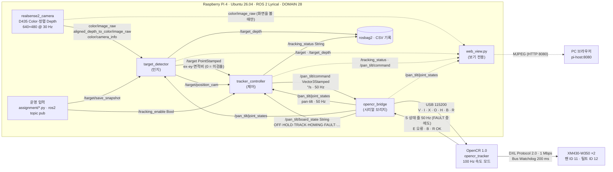

# 프로젝트 1 보고서 — 비전 기반 객체 추적 시스템

## 문제 1 — 색 기반 객체 인식

### 1-1. 실행 조건·측정 산식 ([#34](https://github.com/Lv2-Monglian-Assignment/Lv2_Monglian_Assignment/issues/34))

평가표 1번에 따라 아래 조건과 산식을 시험 전에 확정한다. 시험 결과는 이 조건과 산식으로만 계산하며, 결과를 본 뒤 조건을 바꾸지 않는다. 조건을 바꿔야 하면 바꾼 이유와 시점을 이 절과 이슈 #34에 먼저 기록하고 새 조건으로 다시 시험한다.

#### 실행 조건
| 항목 | 조건 |
|---|---|
| 목표 | 파란 단일 색 물체 1개: 블록 3×3×6 cm 또는 원기둥(지름 3 cm). 시험마다 사용한 물체를 기록한다 (사진: `results/images`) |
| 카메라 입력 | Raspberry Pi + RealSense D435 컬러 640×480 rgb8 30 fps, `/camera/camera/color/image_raw` |
| 거리·배경·조명 | 카메라–목표 거리, 배경 표시 위치(왼쪽·중앙·오른쪽): **시험 전 확정 후 이슈 #34에 기록** |
| 색 범위 | HSV [102,120,40] ~ [110,255,255] (OpenCV H 0~179, S·V 0~255) |
| 마스크 정리 | 형태학 커널 5 px (open → close) |
| 최소 면적 | 100 px² (원본 해상도 기준) |
| 크기 검증 | 깊이로 환산한 보이는 면적 2.0~30 cm². 깊이를 모르는 후보는 검증 없이 남긴다 |
| 후보 선택 | priority (1 가장 큼 → 2 가까움 → 3 화면 중앙) |
| 번호 유지 재선택 | 0.5 s (이전 3.0 s → 0.5 s, 이슈 #34 확정값). 이유: 3.0 s이면 물체 번호가 바뀔 때마다 3 s 동안 목표를 내보내지 않아 추적이 멈췄다(2026-10-07 6분 추적 기록 `idle_20261007_093207`: LOST 51.6 %, 정지 구간 중앙값 3.03 s). 0.5 s로 바꾼 뒤 3분 기록 `idle_20261007_094124`: TRACKING 85.0 %, LOST 11.6 %, 정지 중앙값 0.53 s |
| 검출 해상도 | detect_scale 1.0 (640×480 원본에서 검출) |
| 설정 파일 | [config/hsv.yaml](config/hsv.yaml) |
| 평가 표본 | 목표가 보이는 프레임 30장 + 목표 없는 프레임 10장, 튜닝에 쓰지 않은 실제 카메라 영상 |
| 정답 | 사람이 원본 사진을 보고 프레임별 목표 유무를 판정한 라벨(labels.csv). 자동 검출 결과를 정답으로 쓰지 않는다 |

#### 측정 산식
- 처리 FPS = 처리 완료 프레임 수 / 실제 경과 초. 카메라 입력 FPS(30)와 구분해 둘 다 적는다.
- 검출률 [%] = 올바른 검출 수 / 목표가 보이는 평가 프레임 수(30) × 100. 올바른 검출은 검출 결과가 사람이 판정한 목표를 가리키는 경우이며, 사람이 검출 이미지와 대조해 확인한다.
- 배경 오검출 = 목표 없는 평가 프레임(10)에서 검출(인지 기록 `detected`=1, `/target` z>0)이 나온 프레임 수. 비율(÷10)을 함께 적는다.
- 미검출 = 목표가 보이는 프레임에서 검출되지 않았거나 다른 물체를 검출한 프레임 수.
- `/target` 값: x·y = 영상 중심 기준 정규화 오차(−1~1), z = 목표 면적 / 영상 면적. 미검출이면 0·0·0을 발행한다.

#### 측정 결과
시험 전이므로 비워 둔다.

| 항목 | 값 |
|---|---|
| 처리 FPS (카메라 입력 FPS) | |
| 검출률 (올바른 검출 / 30) | |
| 배경 오검출 (/10) | |
| 미검출·오선택 프레임과 원인 | |

#### 이전 자료와의 관계
- 세 장면 확인과 대상 후보 30장의 이전 검출 결과는 이 조건 확정 전 다른 설정(HSV [92,80,26]~[120,255,255], 최소 면적 400 px²)으로 계산했다. 이 절의 측정 결과로 옮기지 않는다.
- 대상 후보 30장(파란 원기둥, 사람 판정 30장 모두 목표 있음)은 튜닝에 쓰지 않은 실제 카메라 원본이므로, 위 조건으로 다시 검출해 목표 있음 표본으로 쓸 수 있다. 목표 없음 10장은 위 조건으로 새로 촬영한다.

## 문제 2 — 인지·제어 노드 연결

### 2-1. 노드·연결 구조와 인터페이스 ([#58](https://github.com/Lv2-Monglian-Assignment/Lv2_Monglian_Assignment/issues/58))

#### 구현 내용
- 성취도: 평가표 4 (노드 연결도, 인터페이스 정의, 모의 입력 시험 결과)
- 인지(`target_detector`)가 영상마다 `/target`을 발행하고, 제어(`tracker_controller`)가 이를 받아 속도 명령을 브리지(`opencr_bridge`)를 거쳐 OpenCR로 보낸다.
- 발제 기본 인터페이스와 구현 값:

| 항목 | 발제 규약 | 구현 |
|---|---|---|
| 목표 토픽 | `/target` · `geometry_msgs/msg/PointStamped` | 같음. `target_detector` 발행 → `tracker_controller` 구독 |
| point.x / point.y | 정규화 중심 오차 ex / ey | ex = (cx − W/2)/(W/2), ey = (cy − H/2)/(H/2). 오른쪽·아래 +, −1 ~ +1 |
| point.z | 면적비, 0 = 미검출 | contour_area/(W × H). 미검출이면 x = y = z = 0 (x·y는 제어에 쓰지 않음) |
| header.stamp | 원본 영상 시각 유지 | Color 영상의 stamp를 그대로 복사. 같은·과거 stamp는 발행하지 않고, 제어도 stamp가 늘지 않는 입력은 버림 |
| 발행 | 영상 처리마다, 정상 영상의 미검출은 z = 0 | 처리한 영상마다 (카메라 30 Hz, 실측 28.7~30 Hz) |
| QoS | best-effort, depth 1 | 발행·구독 모두 best-effort · keep-last · depth 1 |
| 상태 | `/tracking_status` 등 | `/tracking_status` (String `상태:사유`, 50 Hz) |
| 모터 명령 | 위치/속도 방식, 단위·부호·주기·정지 | 속도형. `/pan_tilt/command` (Vector3Stamped) x = 팬, y = 틸트 [°/s], 50 Hz. 팬 + = 왼쪽, 틸트 + = 아래. 정지 = 0 발행 |
| 타임아웃 | 마지막 신선한 입력 후 0.5 s | 0.5 s (`config/safety.yaml`, 변경 없음) |

#### 노드·연결 구조도
실선은 추적 동작에 쓰이는 연결, 점선은 보기 전용 구독이다(web_view, best-effort로 구독만 하고 발행하지 않아 로봇 동작에 영향 없음).

#### 노드별 책임
| 노드 | 담당 | 책임 | 실패 시 동작 |
|---|---|---|---|
| realsense2_camera | 통합 | Color·정렬 Depth·CameraInfo 발행 | 멈추면 인지 입력이 없음 |
| target_detector | 인지 | HSV·Contour·크기 검증·선택, `/target` 발행(영상마다, 원본 stamp 유지) | 미검출이면 z = 0 발행, 카메라가 멈추면 발행하지 않음 |
| tracker_controller | 제어 | IDLE/TRACKING/LOST(·SEARCHING) 상태, 각도 Kp P 제어, 속도 상한·데드밴드, 각도 한계(팬 175°·틸트 38°, 밖에서는 바깥 방향 명령 0), CSV 기록 | z = 0 첫 프레임부터 명령 0, 입력이 0.5 s 끊기면 `LOST:input_timeout`, 보드 상태가 FAULT·끊김·HOMING이면 `LOST:board_*` — 모두 명령 0 |
| opencr_bridge | 통합(코드)·제어(시험) | 명령 → 시리얼 `V` 50 Hz, 상태 줄 → `/pan_tilt/joint_states`·`/pan_tilt/board_state`, 시작할 때 기준 자세 이동(`I`), 시리얼 송수신 기록 | 명령이 0.2 s 끊기면 `V 0 0`, 상태 줄이 0.5 s 없으면 `NO_STATUS`. 보드 FAULT면 2 s 뒤 `R`로 자동 복구 최대 3회, 그래도 FAULT면 `FAULT_MANUAL`(수동 복구 요청). 정상 60 s가 지나면 횟수 초기화. 종료 시 `X` |
| OpenCR `opencr_tracker` | 제어 | 100 Hz 속도 실행, 소프트 한계(팬 ±180°·틸트 ±40°), 속도 상한 120°/s | `V`가 300 ms 끊기면 속도 0(토크 유지). 모터 통신이 연속 3회 실패하면 토크 OFF 후 FAULT(상태 줄은 계속 보냄), `R`로 복구. 모터 Bus Watchdog 200 ms |
| web_view.py | 통합 | 웹 관제 (카메라 화면·토픽·상태·로그 보기) | 보기 전용: 발행·서비스 호출 없음, 멈춰도 추적에 영향 없음 |

#### 인터페이스 표
ROS 토픽 (출처: `config/*.yaml`·노드 코드, main 기준 — 2026-10-08 #44·#52·#54 병합 후)

| 토픽 | 형식 | 발행 → 구독 | QoS · 주기 | 내용 · 단위 · 부호 |
|---|---|---|---|---|
| `/target` | geometry_msgs/PointStamped | target_detector → tracker_controller | best-effort depth 1 · 영상마다(약 30 Hz) | x = ex, y = ey (오른쪽·아래 +, −1 ~ +1), z = 면적비 (0 = 미검출). stamp = 원본 영상 |
| `/target/position_cam` | geometry_msgs/PointStamped | target_detector → tracker_controller | best-effort depth 1 · 영상마다 | 목표의 카메라 광학 좌표 [m] (X 오른쪽, Y 아래, Z 앞), 무효면 NaN. SEARCHING(심화)용 |
| `/target_depth` | geometry_msgs/PointStamped | target_detector → 기록 | best-effort depth 1 · 영상마다 | x = 깊이 유효 1/0, y = 유효 픽셀 비율, z = 거리 [m] |
| `/tracking_enable` | std_msgs/Bool | 운영(assignment `common.py`, CLI) → tracker_controller | reliable 10 · 요청 시 | true = 추적 시작 (기본 꺼짐, launch `auto_enable`) |
| `/tracking_status` | std_msgs/String | tracker_controller → 기록 | reliable 10 · 50 Hz | `상태:사유` (예: `TRACKING:ok`, `LOST:no_detection`, `LOST:input_timeout`, `LOST:confirming_1/3`). 각도 한계·보드 상태: `TRACKING:pan_limit`·`tilt_limit`, `LOST:board_fault`·`board_fault_manual`·`board_silent`·`board_homing` |
| `/pan_tilt/command` | geometry_msgs/Vector3Stamped | tracker_controller → opencr_bridge | reliable 10 · 50 Hz | x = 팬, y = 틸트 속도 [°/s] (팬 + = 왼쪽, 틸트 + = 아래). IDLE·LOST에서도 0 발행 |
| `/pan_tilt/joint_states` | sensor_msgs/JointState | opencr_bridge → tracker_controller, target_detector | reliable 10 · 상태 줄마다(50 Hz) | 이름 `pan`·`tilt` (dry_run은 `pan_sim`·`tilt_sim`), 각도 [rad]·속도 [rad/s], 측정값. stamp는 보드 측정 시각으로 보정 |
| `/pan_tilt/board_state` | std_msgs/String | opencr_bridge → tracker_controller | reliable 10 · 50 Hz | `OFF`·`HOLD`·`TRACK`·`HOMING`·`FAULT`·`FAULT_MANUAL`(자동 복구 3회 실패)·`NO_STATUS`(상태 줄 0.5 s 없음)·`SIM`(dry_run) |
| `/camera/camera/color/image_raw` | sensor_msgs/Image | realsense2_camera → target_detector | best-effort depth 1 · 30 Hz | 640×480 Color |
| `/camera/camera/aligned_depth_to_color/image_raw` | sensor_msgs/Image | realsense2_camera → target_detector | best-effort depth 5 · 30 Hz | Color에 정렬한 Depth |
| `/camera/camera/color/camera_info` | sensor_msgs/CameraInfo | realsense2_camera → target_detector | best-effort depth 1 | 내부 파라미터 (fx·fy·cx·cy) |
| `/target/save_snapshot` | std_msgs/String | assignment1.py → target_detector | reliable 10 · 요청 시 | 검출 오버레이 이미지 저장 요청 |
| `/tracker/predicted_target` | geometry_msgs/PointStamped | tracker_controller → (기록) | best-effort depth 1 | 예측 목표 위치 (현재 구독 노드 없음) |
| `/tracker/target_base` | geometry_msgs/PointStamped | tracker_controller → (기록) | reliable 10 | `pan_tilt_base` 기준 목표 위치 |
| `/target_replay` (`/depth`, `/position_cam`) | geometry_msgs/PointStamped | target_detector(`replay.launch.py`) → 분석 | `/target`과 같음 | bag 재처리 결과. 원본 `/target`과 섞지 않도록 분리 (문제 5) |

- `web_view.py`(웹 관제, 보기 전용): `/target`·`/target_depth`·`/tracking_status`·`/pan_tilt/command`·`/pan_tilt/joint_states`를 best-effort로 구독하고, 카메라 영상은 브라우저가 화면을 볼 때만 구독한다. 발행·서비스 호출이 없어 추적에 영향을 주지 않으며, HTTP 8080으로 MJPEG 화면을 보낸다.

시리얼 프로토콜 (Pi ↔ OpenCR, `/dev/ttyACM0` 115200 bps, ASCII 한 줄 = 한 메시지, 이슈 #7)

| 방향 | 메시지 | 의미 |
|---|---|---|
| Pi → OpenCR | `V <pan_dps> <tilt_dps>` | 속도 명령 [°/s]. 브리지가 50 Hz로 계속 보냄 (0이 아닌 값을 받으면 토크를 켬) |
| | `I` | 기준 자세(팬 0°, 틸트 0°)로 이동 후 정지. 브리지가 시작할 때와 `R OK` 뒤에 보냄 (`home_on_start`) |
| | `X` | 즉시 정지 (속도 0, 토크 유지) |
| | `O` | 토크 OFF |
| | `H` · `B <pan_tick> <tilt_tick>` | 기준 자세 설정 (브리지가 시작할 때 `config/device.yaml`의 `home_ticks`를 `B`로 보냄) → 회신 `B`. `B`는 지금까지 센 팬 바퀴 수를 유지한다 (기준 tick 차이만큼만 옮김) |
| | `R` | FAULT 복구 (모터 확인·속도 모드·기준 각도를 다시 잡고 OFF로) → 회신 `R OK` 또는 `E 4`. 브리지가 자동으로 보냄 |
| OpenCR → Pi | `S <ms> <pan_deg> <tilt_deg> <pan_dps> <tilt_dps> <state>` | 상태 50 Hz (측정 각도·속도, state = OFF·HOLD·TRACK·HOMING·FAULT). FAULT 중에도 마지막 각도로 계속 보냄 |
| | `E <code> <text>` | 오류·경고 (1 타임아웃, 2 명령 오류, 3 토크 켜기 거부, 4 FAULT, 5 기준 자세 시간 초과) |

정지가 걸리는 시간 (층별)

| 끊긴 곳 | 감지 위치 | 시간 | 동작 |
|---|---|---|---|
| 인지 입력 (`/target` 침묵) | tracker_controller | 0.5 s | `LOST:input_timeout`, 명령 0 |
| 제어 명령 (`/pan_tilt/command` 침묵) | opencr_bridge | 0.2 s | `V 0 0` 전송 |
| 시리얼 (`V` 없음) | OpenCR 펌웨어 | 300 ms | 속도 0, 토크 유지 (`E 1 command timeout; stop`) |
| 모터 통신 (OpenCR 멈춤) | XM430 Bus Watchdog | 200 ms | 모터가 스스로 정지 |
| 모터 통신 실패 (OpenCR ↔ 모터) | OpenCR 펌웨어 | 연속 3회 (제어 주기 3번) | 토크 OFF 후 FAULT, 상태 줄(`… FAULT`)은 계속 보냄 → 제어 노드 `LOST:board_fault`, 명령 0 |
| 보드 FAULT 지속 | opencr_bridge | 2 s 뒤, 최대 3회 | `R`로 자동 복구 → 복구되면 기준 자세로 이동 후 추적 재개. 3회 모두 실패하면 `FAULT_MANUAL`(수동 복구: 케이블·전원 확인 후 추적 재시작 또는 OpenCR 리셋), 제어 노드 `LOST:board_fault_manual`. 정상 60 s가 지나면 횟수 초기화 |
| 보드 상태 줄 | opencr_bridge · tracker_controller | 0.5 s · 1 s | `NO_STATUS` · `LOST:board_silent`, 명령 0 |

#### 다섯 입력 확인 결과 (모터 출력 끔)
- 실행: `python3 assignment/assignment2.py`. 제어 노드만 실행하고 브리지는 띄우지 않으므로 OpenCR·모터에 명령이 가지 않는다. 시험 프로그램이 `/target`(best-effort)을 직접 발행하고 `/pan_tilt/command`·`/tracking_status`를 기록한다.
- 조건: 2026-10-07 12:37, Raspberry Pi(monglian), run_id `assignment2_mock_20261007_123707`, Kp 팬 2.0·틸트 2.5 [1/s], direction 팬 −1·틸트 +1, 속도 상한 120°/s, 입력 타임아웃 0.5 s. 입력은 30 Hz로 3 s 발행 (발행 중단은 2 s 발행 후 중단). #52·#54 병합(2026-10-08) 전 코드로 한 시험이다.

| 입력 | 발제 기대 결과 | 상태 | 팬 명령 [°/s] | 틸트 명령 [°/s] | 판정 |
|---|---|---|---|---|---|
| x = 0, z > 0 | 중심에서 불필요한 회전 없음 | `TRACKING:ok` | 0 | 0 | PASS |
| x = +0.4, z > 0 | 오른쪽 오차를 줄이는 명령 | `TRACKING:ok` | −23.87 (오른쪽으로 회전) | 0 | PASS |
| x = −0.4, z > 0 | 반대 방향 명령 | `TRACKING:ok` | +23.87 | 0 | PASS |
| z = 0 | 이전 목표를 쫓지 않고 정지 | `LOST:no_detection` | 0 | 0 | PASS |
| 발행 중단 | 타임아웃 감지 후 정지 | `LOST:input_timeout` (0.522 s 뒤) | 0 | 0 | PASS |
| (추가) 같은 stamp 재전송 | 신선한 입력이 아니므로 정지 | `LOST:input_timeout` | 0 | 0 | PASS |
| (추가) y = +0.4, z > 0 | 아래 오차를 줄이는 틸트 명령 | `TRACKING:ok` | 0 | +22.5 (아래로 회전) | PASS |

- 명령 크기 확인: x = +0.4 → 각도 오차 atan(0.4 × tan(55.7°/2)) = 11.94° → 2.0 × 11.94 = 23.87°/s, 팬 direction −1이라 −23.87. y = +0.4 → atan(0.4 × tan(43.2°/2)) = 9.00° → 2.5 × 9.00 = 22.5°/s.
- 0.522 s는 마지막 `/target` 발행부터 `LOST:input_timeout`과 명령 0이 관측될 때까지의 시간이다(상태·명령은 50 Hz로 기록하므로 관측 간격 포함).
- 결과물: `results/assignment2/assignment2_mock_20261007_123707/` (`cases.csv` 판정표, 입력별 `<case>.csv` 시계열, `controller.log`, `summary.md`)

#### 해석
- **부호가 반대일 때**: 오른쪽 목표(ex > 0)에서 카메라가 왼쪽으로 돌면 목표가 화면 오른쪽으로 더 밀려 ex가 커지고, P 제어는 더 큰 명령을 낸다(양의 되먹임). 카메라는 속도 상한(120°/s)까지 빨라지며 목표가 시야 밖으로 나가 z = 0이 되면 정지하고(`LOST:no_detection`), 그 전에 소프트 한계(팬 ±180°·틸트 ±40°)에 걸릴 수도 있다. Kp를 키우면 더 빨리 벗어날 뿐이므로 검출 → 오차 부호 → 명령 → 응답 순서로 확인한다. 이 장비는 추적을 끈 상태에서 `scripts/test/direction_test.py`로 작은 명령(15°/s × 2 s)의 실제 회전 방향을 보고 direction을 정했다(팬 + = 왼쪽 → −1, 틸트 + = 아래 → +1, 2026-10-07 제출 장비 틸트 재조립 후 다시 확인, 2026-10-08 다른 장비에서도 같은 결과 — 아래 방향 확인 기록).
- **미검출(z = 0)과 토픽 침묵의 차이**: z = 0은 "인지는 정상이고 이 영상에 목표가 없다"는 정보라 영상마다 도착하므로 첫 프레임부터 명령 0(`LOST:no_detection`). 토픽 침묵은 "인지 쪽이 멈췄거나 연결이 끊겼다"는 뜻이고 제어 노드는 메시지가 오지 않는다는 것만 알 수 있으므로, 마지막 신선한 입력 후 0.5 s를 기다려 `LOST:input_timeout`으로 멈춘다(시험 0.522 s). 사유가 다르게 기록되므로 실패 원인(검출 대 통신)을 로그로 구분할 수 있다. 카메라가 멈췄는데 이전 영상에 새 시각을 붙여 보내면 침묵이 정상 입력처럼 보여 마지막 목표를 계속 쫓게 되므로, 인지는 원본 stamp를 유지하고 제어는 stamp가 늘지 않는 입력을 버린다(같은 stamp 재전송 시험 PASS).
- **노드별 책임과 층별 정지**: 각 층이 바로 위 층의 끊김을 스스로 감지해 멈춘다. 인지 침묵은 제어(0.5 s), 제어 침묵은 브리지(0.2 s), 브리지·Pi 침묵은 OpenCR(300 ms), OpenCR 멈춤은 모터 Bus Watchdog(200 ms)이 처리한다. 그래서 어느 위 층이 멈춰도 마지막 명령으로 계속 움직이지 않는다.

방향 확인 기록 (`scripts/test/direction_test.py`, 추적을 끈 상태, 15°/s × 2 s, 2026-10-08 14:27, 다른 장비 — Pi 계정 `pa23`)

| 축 | 명령 | 측정 각도 변화 | 카메라가 돈 방향 (눈으로 확인) | 판정 |
|---|---|---|---|---|
| 팬 | `V +15 0` 2 s | +30.2° (tick 증가) | 왼쪽 | 팬 + = 왼쪽 → `pan_direction = -1`, `control.yaml`과 일치 |
| 틸트 | `V 0 +15` 2 s | +29.4° (tick 증가) | 아래 | 틸트 + = 아래 → `tilt_direction = +1`, `control.yaml`과 일치 |

- 결과 PASS. 되돌림 명령(−15°/s × 2 s)으로 팬 −30.2°, 틸트 −30.5° 돌아와 제자리로 복귀.
- 기록: [results/logs/direction_test_20261008_142755.log](results/logs/direction_test_20261008_142755.log) (시험 화면 출력), 원본 영상: [results/media/direction_test_20261008_142638.mp4](results/media/direction_test_20261008_142638.mp4) (23.7 s, 1080×1080). 위 GIF는 이 영상을 실제 속도로 줄인 것(270 px, 5 fps)

#### 한계
- 다섯 입력 시험은 #52·#54 병합 전(2026-10-07) 코드로 제어 노드만 실행한 결과다. 병합으로 각도 한계(`TRACKING:pan_limit`·`tilt_limit`)와 보드 상태 사유(`LOST:board_*`)가 생겼으므로, 병합 후 코드로 같은 시험을 다시 하고 보드 상태별 정지(FAULT·끊김·자동 복구 실패)도 확인한다. 브리지 없이 하는 모의 시험에서는 보드 상태를 검사하지 않는다.
- 모의 입력은 명령의 부호·크기와 상태만 확인한다. 실제 모터가 오차를 줄이는 방향으로 도는지는 문제 3의 실물 추적에서 확인한다.
- `/tracker/predicted_target`·`/tracker/target_base`는 발행만 하고 구독하는 노드가 없다(기록용). 쓰지 않으면 정리한다.
- 심화의 `/search` 액션(요청·진행·성공/실패·취소)은 구현하지 않았다. 시야 밖 탐색은 제어 노드의 SEARCHING 상태(기본 꺼짐, 도전 B)로만 시험했다.

## 문제 3 — 객체 중심 기반 추적 제어

### 3-1. Kp 2종 × 3회 계단 응답 비교 ([#9](https://github.com/Lv2-Monglian-Assignment/Lv2_Monglian_Assignment/issues/9)) + 추가 3종

#### 구현 내용
- 성취도: 제어 담당 체크리스트 9 (Kp 2종 각 3회 시험, 원본 CSV와 비교 결과로 특성 설명)
- 추적 제어 노드 이전 단계로, OpenCR의 위치 P 제어에서 Kp 값에 따른 반응 속도·오버슈트·정착을 팬·틸트 모터별로 비교해 추적 Kp 후보를 정하는 근거로 사용
- 필수 2종(Kp 2.0, 3.0)을 먼저 비교한 뒤, 두 값 사이에서 오버슈트가 언제 생기는지 보려고 **추가 3종(Kp 2.1, 2.2, 2.5)**을 같은 조건으로 시험
- 펌웨어: `opencr_position_p` (모터 속도 모드 + OpenCR 위치 P, `command = clamp(Kp × 오차, ±속도 상한)`, 데드밴드 0.2°)

#### 실행 조건
| 항목 | 값 |
|---|---|
| 모터 | 팬 DYNAMIXEL XM430-W350-T ID 11, 틸트 XM430-W350-T ID 12 (1 Mbps, Protocol 2.0) |
| Kp | 필수 2종: 2.0, 3.0 / 추가 3종: 2.1, 2.2, 2.5 [1/s] (각도 오차 → 각속도 명령) |
| 속도 상한 | 120°/s |
| 제어 주기 · 로그 주기 | 100 Hz · 10 Hz |
| 시작 자세 | 명령 시점 위치를 0°로 두고 2초 대기 후 계단 이동 |
| 목표 각도 | 팬 +90°, 틸트 ±40° (틸트 기구 간섭 한계) |
| 반복 | 모터·Kp별 3회, 총 30회 (필수 12회 + 추가 18회, 실패 회차 없음) |
| 명령 | 시리얼 모니터에서 `s <Kp> 120 <목표각>` → 정착 후 `x` (정지·토크 OFF) |

- 틸트 Kp 2.0·3.0은 run 1이 +40°, run 2·3이 −40°입니다. 추가 3종은 3회 모두 +40°입니다. 분석할 때 −40° 회차는 위치·목표·명령의 부호를 뒤집어 양수로 맞췄습니다.
- Kp 외 설정(속도 상한·데드밴드·부하·장착 상태)은 바꾸지 않았습니다.

#### 결과물
| 내용 | 위치 |
|---|---|
| 틸트 CSV (Kp 2.0 `kp1`, 3.0 `kp2`, 2.5 `kp3`, 2.2 `kp4`, 2.1 `kp5`, 각 `run{1,2,3}`) | `results/logs/kp{1..5}_run*_s<Kp>_v120_a.csv` |
| 팬 CSV (같은 번호, 앞에 `pan_`) | `results/logs/pan_kp{1..5}_run*_s<Kp>_v120_a+90.csv` |
| 틸트 비교 플롯 | [results/plots/kp_step_tilt.png](results/plots/kp_step_tilt.png) |
| 팬 비교 플롯 | [results/plots/kp_step_pan.png](results/plots/kp_step_pan.png) |

- CSV 열: `run_id, kp, t_s, target_deg, position_deg, error_deg, p_deg_s, u_deg_s, speed_deg_s, v_limit_deg_s, dt_ms`
- CSV 구간: 회차마다 최종값 ±0.1° 안에 계속 머물기 시작하는 시점을 구하고, 모터별로 그중 가장 늦은 시점 + 1샘플(0.1 s)까지 모든 회차를 같은 길이로 자름 (틸트 0~9.3 s, 팬 0~7.2 s, 로그 시각 기준). 추가 시험에서 정착 후 1틱씩 오가는 회차(틸트 Kp 2.1 run 2, 팬 Kp 2.2 run 3)가 있어 구간이 늘었고, 필수 2종 CSV도 같은 기준으로 다시 잘랐습니다(기존 구간의 값은 그대로).
- 원본 시리얼 로그(텍스트)는 로컬에 보관하고 저장소에는 CSV만 올립니다.

#### 측정 결과
산식 (계단 명령 시점을 0 s로 맞추고 10 ms 간격으로 선형 보간한 곡선 기준, 회차마다 계산 후 평균):
- 오버슈트 = 최대 위치 − 목표
- 상승 시간 = 목표의 90% 도달 시각 − 10% 도달 시각
- 1° 이내 진입 = 이후 계속 |위치 − 목표| < 1°가 되는 첫 시각
- 포화 = 속도 명령 |u| ≥ 119°/s인 로그 샘플 수 × 0.1 s

**틸트 (목표 40°)**

*그림 3-1. 틸트 모터 Kp 2.0·2.1·2.2·2.5·3.0 계단 응답. 선은 3회 평균, 띠는 3회 최소~최대(−40° 회차는 양수로 보정). 위: 위치, 아래: 속도 명령. 범례 지표는 아래 표의 평균값.*

| 회차 | Kp | 오버슈트 [°] | 상승 [s] | 1° 이내 [s] | 최대 명령 [°/s] | 포화 [s] |
|---|---|---|---|---|---|---|
| run 1 (+40°) | 2.0 | −0.01 | 1.06 | 2.03 | 79.7 | 0.0 |
| run 2 (−40°) | 2.0 | −0.19 | 1.03 | 1.96 | 79.7 | 0.0 |
| run 3 (−40°) | 2.0 | −0.19 | 1.03 | 1.96 | 79.7 | 0.0 |
| **평균** | **2.0** | **−0.13** | **1.04** | **1.98** | | |
| run 1 (+40°) | 2.1 | −0.27 | 1.03 | 1.98 | 83.8 | 0.0 |
| run 2 (+40°) | 2.1 | −0.19 | 1.02 | 1.98 | 83.8 | 0.0 |
| run 3 (+40°) | 2.1 | −0.19 | 1.04 | 1.98 | 83.8 | 0.0 |
| **평균** | **2.1** | **−0.22** | **1.03** | **1.98** | | |
| run 1 (+40°) | 2.2 | −0.19 | 0.97 | 1.84 | 87.9 | 0.0 |
| run 2 (+40°) | 2.2 | −0.19 | 0.99 | 1.87 | 87.9 | 0.0 |
| run 3 (+40°) | 2.2 | −0.27 | 0.98 | 1.83 | 87.9 | 0.0 |
| **평균** | **2.2** | **−0.22** | **0.98** | **1.85** | | |
| run 1 (+40°) | 2.5 | −0.19 | 0.79 | 1.58 | 100.3 | 0.0 |
| run 2 (+40°) | 2.5 | −0.27 | 0.77 | 1.55 | 100.3 | 0.0 |
| run 3 (+40°) | 2.5 | −0.19 | 0.78 | 1.56 | 100.3 | 0.0 |
| **평균** | **2.5** | **−0.22** | **0.78** | **1.56** | | |
| run 1 (+40°) | 3.0 | +3.33 | 0.64 | 1.72 | 119.5 | 0.2 |
| run 2 (−40°) | 3.0 | +3.24 | 0.64 | 1.74 | 119.5 | 0.2 |
| run 3 (−40°) | 3.0 | +3.15 | 0.64 | 1.76 | 119.5 | 0.2 |
| **평균** | **3.0** | **+3.24** | **0.64** | **1.74** | | |

**팬 (목표 90°)**

*그림 3-2. 팬 모터 Kp 2.0·2.1·2.2·2.5·3.0 계단 응답. 선은 3회 평균, 띠는 3회 최소~최대. 위: 위치, 아래: 속도 명령. 범례 지표는 아래 표의 평균값.*

| 회차 | Kp | 오버슈트 [°] | 상승 [s] | 1° 이내 [s] | 최대 명령 [°/s] | 포화 [s] |
|---|---|---|---|---|---|---|
| run 1 | 2.0 | +1.76 | 1.02 | 2.20 | 119.5 | 0.9 |
| run 2 | 2.0 | +1.76 | 1.02 | 2.20 | 119.5 | 0.9 |
| run 3 | 2.0 | +2.64 | 1.01 | 2.39 | 119.5 | 0.9 |
| **평균** | **2.0** | **+2.05** | **1.02** | **2.26** | | |
| run 1 | 2.1 | +5.27 | 0.99 | 2.76 | 119.5 | 0.9 |
| run 2 | 2.1 | +4.83 | 1.00 | 2.74 | 119.5 | 0.9 |
| run 3 | 2.1 | +5.89 | 0.98 | 2.80 | 119.5 | 0.9 |
| **평균** | **2.1** | **+5.33** | **0.99** | **2.77** | | |
| run 1 | 2.2 | +8.09 | 0.96 | 2.94 | 119.5 | 0.9 |
| run 2 | 2.2 | +7.65 | 0.97 | 2.93 | 119.5 | 0.9 |
| run 3 | 2.2 | +7.20 | 0.98 | 2.93 | 119.5 | 0.9 |
| **평균** | **2.2** | **+7.64** | **0.97** | **2.93** | | |
| run 1 | 2.5 | +16.17 | 0.92 | 3.26 | 119.5 | 1.0 |
| run 2 | 2.5 | +15.82 | 0.92 | 3.24 | 119.5 | 1.0 |
| run 3 | 2.5 | +15.47 | 0.93 | 3.20 | 119.5 | 1.0 |
| **평균** | **2.5** | **+15.82** | **0.92** | **3.23** | | |
| run 1 | 3.0 | +27.86 | 0.88 | 3.29 | 119.5 | 1.1 |
| run 2 | 3.0 | +26.81 | 0.88 | 3.30 | 119.5 | 1.1 |
| run 3 | 3.0 | +26.81 | 0.89 | 3.29 | 119.5 | 1.1 |
| **평균** | **3.0** | **+27.16** | **0.88** | **3.29** | | |

- 최종 위치 오차는 모든 회차에서 0.3° 이내입니다 (최대 0.27°, 데드밴드 0.2°와 1틱 0.088° 수준).
- 측정 속도 최대: 틸트 Kp 2.0·2.1 약 51°/s, 2.2 약 54°/s, 2.5 약 58°/s, 3.0 약 60°/s / 팬 Kp 2.0 약 92°/s, 2.1 약 93°/s, 2.2 약 96°/s, 2.5 약 100°/s, 3.0 약 105°/s.
- 틸트 Kp 2.0 run 3의 오버슈트는 처음 정리 때 −0.27°였으나, CSV 구간이 늘면서 그 뒤에 1틱(0.088°) 올라간 값이 최대가 되어 −0.19°가 되었습니다(평균 −0.16° → −0.13°).

#### 해석
- **반복성**: 같은 Kp의 3회 결과가 거의 같습니다 (오버슈트 표준편차 틸트 0.09° 이하, 팬 0.50° 이하, 상승 시간 차이 0.03 s 이하). 틸트는 +40°와 −40° 회차의 차이도 작아 방향에 따른 영향은 크지 않았습니다.
- **틸트**: Kp 2.0~2.5에서는 명령이 상한에 닿지 않고(최대 79.7~100.3°/s) 3회 모두 오버슈트 없이 목표 0.2~0.3° 앞에서 멈췄습니다. Kp가 커질수록 상승(1.04 → 0.78 s)과 1° 이내 진입(1.98 → 1.56 s)이 빨라졌습니다. Kp 3.0에서 처음으로 명령이 120°/s 상한에 닿고 약 3.2° 넘어갔으며, 1° 이내 진입은 Kp 2.5보다 오히려 0.18 s 늦었습니다. 오버슈트가 생기는 경계는 2.5와 3.0 사이입니다.
- **팬**: 목표가 90°로 커서 모든 Kp에서 명령이 120°/s 상한에 걸려 상승 시간 차이는 0.14 s 이내입니다. 오버슈트는 Kp에 따라 빠르게 커져(2.0: 2.1° → 2.1: 5.3° → 2.2: 7.6° → 2.5: 15.8° → 3.0: 27.2°) 1° 이내 진입도 2.26 → 3.29 s로 늦어졌습니다. 2.0에서 0.1만 올려도 오버슈트가 2.6배가 되어, 팬은 Kp 2.0 근처가 이미 한계입니다.
- **오버슈트 원인 (가설)**: 명령이 상한에서 내려오기 시작하는 오차는 120/Kp(Kp 2.0: 60°, 3.0: 40°)라, Kp가 클수록 목표에 더 가까이 와서야 감속을 시작합니다. 그런데 측정 속도는 명령을 늦게 따라가므로(명령 120°/s일 때 측정 최대 92~105°/s), 감속 명령이 나올 때 실제 속도가 아직 커서 넘어갑니다. 팬은 이동 거리가 길어 속도가 크게 올라가므로 영향이 크고, 틸트는 이동 거리가 짧아 Kp 2.5까지는 넘어가지 않았습니다.
- **선택**: 팬은 **Kp 2.0**, 틸트는 **Kp 2.5**가 적절합니다. 틸트 Kp 2.5는 오버슈트 없이 Kp 2.0보다 상승이 25%, 1° 이내 진입이 0.42 s 빠르고, ±40° 기구 간섭 근처에서도 넘어가지 않습니다. 팬은 0.1만 올려도 오버슈트가 크게 늘어 2.0을 유지합니다.

#### 심화
- 필수 2종 사이의 Kp 2.1·2.2·2.5를 추가로 3회씩 시험해 모터별로 오버슈트가 생기는 경계를 확인했습니다 (위 표·그림).

#### 한계
- 이 시험의 Kp는 **각도 루프** 기준([1/s])이라, 영상 오차 ex 기준 추적 Kp와 단위가 다릅니다. 추적 Kp 2종 × 3회 시험(왼쪽 → 중앙 → 오른쪽 → 중앙, 오차·명령·상태 CSV)은 추적 제어 노드 구현 후 별도로 수행합니다.
- 로그 주기가 10 Hz라 시간 지표는 0.1 s 해상도의 샘플을 보간한 값입니다.
- 오버슈트 원인은 감속 시작 오차와 측정 속도로 세운 가설이며, 모터 가속 설정을 바꿔 확인하지는 않았습니다.
- 정착 후 1틱(0.088°)씩 오가는 회차가 있습니다(예: 틸트 Kp 2.1 run 2는 39.64° ↔ 39.73°를 9.2 s까지 반복). 오차가 데드밴드 0.2°를 조금 넘으면 명령이 최소 단위(1.374°/s) 하나로 나가 1틱 움직이고, 데드밴드 안으로 들어가면 멈춘 뒤 자중으로 다시 처지는 것으로 봅니다. 크기가 1틱이라 지표에는 영향이 거의 없습니다.
- 추가 3종의 틸트는 +40° 방향만 시험했습니다.
]633;E;printf '\\n\\n';cc1a40c8-10c5-415b-ae05-b586d7459c26]633;C

## 인지 구현

D435 컬러 영상에서 HSV 마스크와 형태학 연산·Contour로 가장 큰 유효 후보를 검출하고, 실제 영상 크기로 정규화한 중심 오차와 면적비를 `/target` PointStamped로 전달한다. 미검출 영상은 0을 발행하고 입력 중단 시 이전 결과를 재발행하지 않는다.

[인지 보고서](docs/perception/report.md)에 실험 환경·목적·방법·실제 결과·한계를 기록했다. [코드 배치와 실행](docs/perception/README.md), [수행 계획](../vision_todo/vision_todo.md), [실제 결과 자료](results/logs/perception/)를 연결한다.

확인 결과: 기존 인지 증거 5/7단계, 약 71%. 새 팀 패키지 2개 PC 빌드·합성 검사 15개·카메라 없는 launch 기동/정상 종료를 확인했다. 기존 Pi 모듈 실측과 새 패키지 검증을 구별한다. 독립 30·10프레임 정답 평가와 실제 협업 증빙은 미완료다.
