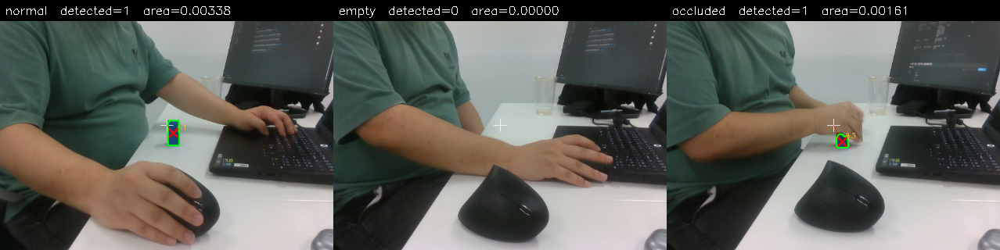
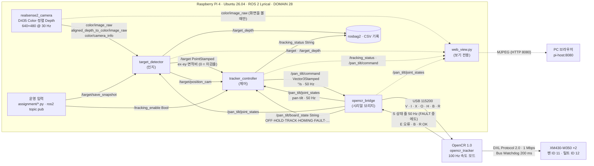
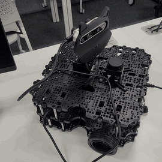
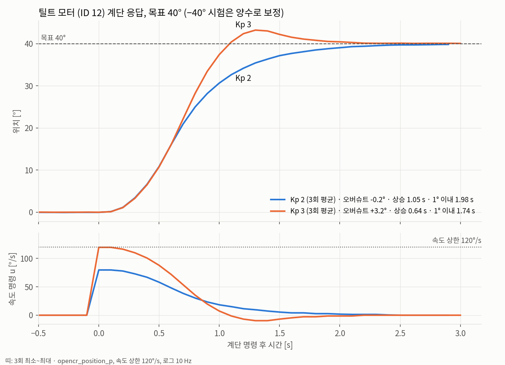
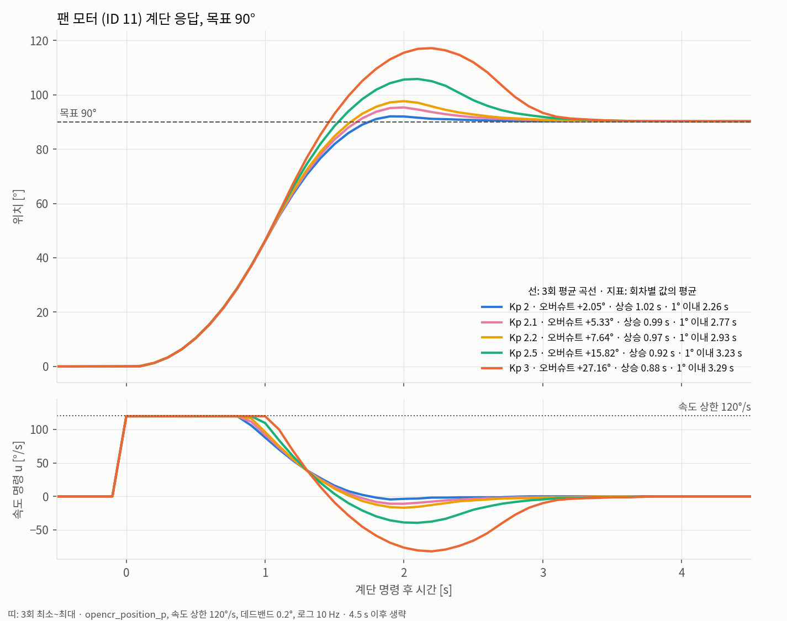
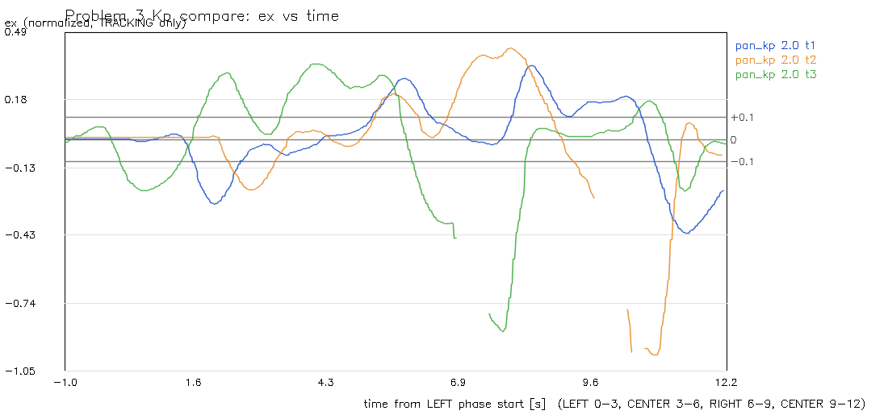
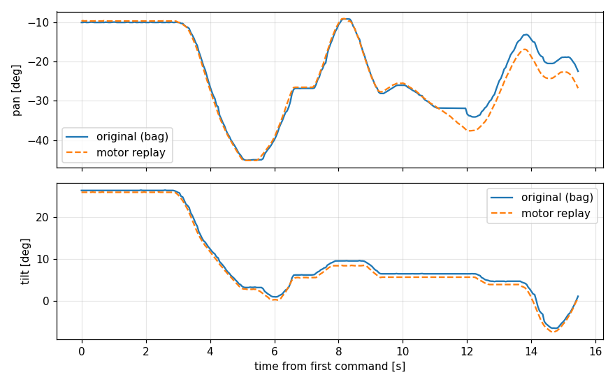

# 프로젝트 1 보고서 — 비전 기반 객체 추적 시스템

## 문제 1 — 색 기반 객체 인식

> 이 보고서와 [README.md](README.md)가 팀의 기준 문서입니다. `docs/perception/` 폴더의 파일과 [vision_todo.md](../vision_todo/vision_todo.md)는 인지 담당(최성진)의 실험 기록으로, 당시 설정·진행 상태를 그대로 남겨 두었습니다. 값이 이 문서와 다르면 이 문서를 따릅니다.

#### 구현 내용
- 성취도: 평가표 1(시험 조건 정의)·3(HSV·Contour 검출), 인지 담당 체크리스트 5~7
- 노드: `target_detector` ([ros2_ws/src/target_detector/](ros2_ws/src/target_detector/)). 검출 함수는 `detection.py`, ROS 입출력은 `target_detector.py`, 여러 물체 번호 유지는 `object_tracker.py`
- 순서: Color 영상(rgb8) → HSV 변환 → 색 범위 마스크 → 형태학 open·close → Contour → 최소 면적 → (깊이가 있으면) 실제 보이는 면적으로 크기 검증 → 후보 선택(priority) → 번호 유지 → `/target` 발행
- 출력: 처리한 영상마다 `/target`(PointStamped)을 원본 영상 stamp로 발행. x·y = 정규화 중심 오차, z = 면적비, 미검출이면 0·0·0. 입력이 멈추면 발행하지 않는다(이전 결과를 다시 보내지 않음)
- 설정: [config/hsv.yaml](config/hsv.yaml)(색·면적·크기·선택·번호 유지), [config/camera.yaml](config/camera.yaml)(토픽·깊이·시야각)
- 시험 프로그램: [assignment/assignment1.py](assignment/assignment1.py)(세 장면), [assignment/assignment4.py](assignment/assignment4.py) `eval`·`score`(30·10프레임 사람 대조), 사진 평가 [scripts/evaluate_perception_dataset.py](scripts/evaluate_perception_dataset.py)

### 1-1. 실행 조건·측정 산식 ([#34](https://github.com/Lv2-Monglian-Assignment/Lv2_Monglian_Assignment/issues/34))

평가표 1번에 따라 아래 조건과 산식을 시험 전에 확정한다. 시험 결과는 이 조건과 산식으로만 계산하며, 결과를 본 뒤 조건을 바꾸지 않는다. 조건을 바꿔야 하면 바꾼 이유와 시점을 이 절과 이슈 #34에 먼저 기록하고 새 조건으로 다시 시험한다.

#### 실행 조건
| 항목 | 조건 |
|---|---|
| 목표 | 파란 단일 색 물체 1개: 블록 3×3×6 cm 또는 원기둥(지름 3 cm). 시험마다 사용한 물체를 기록한다 (사진: `results/images`) |
| 카메라 입력 | Raspberry Pi + RealSense D435 컬러 640×480 rgb8 30 fps, `/camera/camera/color/image_raw` |
| 거리·배경·조명 | 카메라–목표 거리, 배경 표시 위치(왼쪽·중앙·오른쪽): **시험 전 확정 후 이슈 #34에 기록** |
| 색 범위 | HSV [102,120,40] ~ [110,255,255] (OpenCV H 0~179, S·V 0~255) |
| 마스크 정리 | 형태학 커널 5 px (open → close) |
| 최소 면적 | 100 px² (원본 해상도 기준) |
| 크기 검증 | 깊이로 환산한 보이는 면적 2.0~30 cm². 깊이를 모르는 후보는 검증 없이 남긴다 |
| 후보 선택 | priority (1 가장 큼 → 2 가까움 → 3 화면 중앙) |
| 번호 유지 재선택 | 0.5 s (이전 3.0 s → 0.5 s, 이슈 #34 확정값). 이유: 3.0 s이면 물체 번호가 바뀔 때마다 3 s 동안 목표를 내보내지 않아 추적이 멈췄다(2026-10-07 6분 추적 기록 `idle_20261007_093207`: LOST 51.6 %, 정지 구간 중앙값 3.03 s). 0.5 s로 바꾼 뒤 3분 기록 `idle_20261007_094124`: TRACKING 85.0 %, LOST 11.6 %, 정지 중앙값 0.53 s |
| 검출 해상도 | detect_scale 1.0 (640×480 원본에서 검출) |
| 설정 파일 | [config/hsv.yaml](config/hsv.yaml) |
| 평가 표본 | 목표가 보이는 프레임 30장 + 목표 없는 프레임 10장, 튜닝에 쓰지 않은 실제 카메라 영상 |
| 정답 | 사람이 원본 사진을 보고 프레임별 목표 유무를 판정한 라벨(labels.csv). 자동 검출 결과를 정답으로 쓰지 않는다 |

#### 측정 산식
- 처리 FPS = 처리 완료 프레임 수 / 실제 경과 초. 카메라 입력 FPS(30)와 구분해 둘 다 적는다.
- 검출률 [%] = 올바른 검출 수 / 목표가 보이는 평가 프레임 수(30) × 100. 올바른 검출은 검출 결과가 사람이 판정한 목표를 가리키는 경우이며, 사람이 검출 이미지와 대조해 확인한다.
- 배경 오검출 = 목표 없는 평가 프레임(10)에서 검출(인지 기록 `detected`=1, `/target` z>0)이 나온 프레임 수. 비율(÷10)을 함께 적는다.
- 미검출 = 목표가 보이는 프레임에서 검출되지 않았거나 다른 물체를 검출한 프레임 수.
- `/target` 값: x·y = 영상 중심 기준 정규화 오차(−1~1), z = 목표 면적 / 영상 면적. 미검출이면 0·0·0을 발행한다.

#### 결과물
| 내용 | 위치 |
|---|---|
| 40프레임 평가 (목표 있음 30 + 없음 10, 위 조건) | [results/logs/perception/issue34-forty-frame-evaluation-002/](results/logs/perception/issue34-forty-frame-evaluation-002/REPORT_KO.md) (`evaluation.json` 집계·정의, `frames.csv` 프레임별 판정, 평가에 쓴 `source/hsv.yaml`) |
| 목표 있음 30장 원본·마스크·검출 이미지와 사람 판정 | [results/logs/perception/issue34-present-color-review-001/](results/logs/perception/issue34-present-color-review-001/REPORT_KO.md) (`human-evaluation.csv`) |
| 세 장면 (정상·대상 없음·가림), 위 조건 | [results/assignment1/assignment1_20261007_140644/](results/assignment1/assignment1_20261007_140644/summary.md) (`scenes.csv`, 장면별 원본·마스크·검출 이미지, `camera.txt`, 사용한 `config/` 사본), 모아 보기 [results/images/assignment1_scenes_montage.png](results/images/assignment1_scenes_montage.png) |
| 세 장면, 이전 설정 (아래 "이전 자료와의 관계") | [results/logs/perception/three-scenes-001/](results/logs/perception/three-scenes-001/REPORT_KO.md), 이미지 `results/images/perception/{normal,absent,occluded}/` |
| `/target` header(stamp·frame_id) 유지 확인, 10쌍 | [results/logs/perception/target-header-check-002/](results/logs/perception/target-header-check-002/CHECK_KO.md) (PC 검출 노드, DOMAIN 30 구성) · [pi-local-header-001](results/logs/perception/pi-local-header-001/result.json) (Pi 검출 노드) |

재현 명령은 [README.md 8절](README.md#8-문제별-시험-재현)에 있습니다.

#### 측정 결과
40프레임 평가 (2026-10-08, [#46](https://github.com/Lv2-Monglian-Assignment/Lv2_Monglian_Assignment/pull/46)). Pi D435로 촬영한 컬러 사진에 위 색 범위·커널·최소 면적·priority를 그대로 적용했다(커밋 `76e77bd`의 `detection.py`, 모터 사용 안 함). 정답은 사람이 사진을 보고 정했다.

| 항목 | 값 |
|---|---|
| 처리 FPS (카메라 입력 FPS) | 이 평가는 저장한 사진을 처리해 측정하지 않음. 실시간(카메라 + 검출 노드, 미리보기 끔, 39.5 s): **30.00 FPS** (카메라 30 Hz), 한 프레임 처리 평균 12.85 ms ([실험 1](results/param_experiments/detect_scale/summary.md)). 추적 중(카메라·인지·제어·브리지 모두 실행)에는 27.35 FPS(카메라 27.3 Hz, 문제 4 정상 추적) |
| 검출률 (올바른 검출 / 30) | **30/30 = 100 %** (TP 30, FN 0, 다른 물체 선택 0) |
| 배경 오검출 (/10) | **0/10 = 0 %** (TN 10, 10장 모두 마스크 픽셀 0) |
| 미검출·오선택 프레임과 원인 | 없음 |

세 장면 (위 조건, 2026-10-07 14:06, Pi pa23, 커밋 `8f897bb`, `python3 assignment/assignment1.py`). 검출 노드가 실제로 처리한 영상을 장면마다 저장했고, 값은 그 프레임의 `/target`이다. 파란 목표 1개, 카메라에서 약 0.75~0.77 m.

| 장면 | 검출 | ex | ey | 면적비 z | 후보 · 크기 제외 | 깊이 [m] |
|---|---|---|---|---|---|---|
| 정상 | 1 | +0.0406 | +0.0635 | 0.00338 | 1 · 0 | 0.773 |
| 대상 없음 | 0 | 0 | 0 | 0 | 0 · 0 | (없음) |
| 일부 가림 (손) | 1 | +0.0517 | +0.1314 | 0.00161 | 1 · 0 | 0.750 |



- 대상 없음은 `/target`이 0·0·0으로 나가 "목표 없음"으로 전달된다. 가림에서는 면적비가 0.00338 → 0.00161(48 %)로 줄고 중심이 보이는 부분 쪽(아래)으로 옮겨 갔다. 가려진 물체 전체의 중심을 추정하지 않고 보이는 영역의 중심을 낸다.
- 카메라 기록(같은 실행의 `camera.txt`): Color 640×480 rgb8, 수신 29.0 Hz, frame_id `camera_color_optical_frame`, 정렬 Depth 640×480 16UC1(mm) 25.0 Hz, CameraInfo fx 605.85 · fy 605.68 · cx 324.37 · cy 245.14, 왜곡 plumb_bob(계수 0), python3-opencv 4.10.0, librealsense2 2.58.4, realsense2_camera 4.58.4, D435 USB 3(5000M).
- 사진에는 시험자 상반신이 나오며 얼굴은 없다.

#### 이전 자료와의 관계
- 세 장면 확인과 대상 후보 30장의 이전 검출 결과는 이 조건 확정 전 다른 설정(HSV [92,80,26]~[120,255,255], 최소 면적 400 px²)으로 계산했다. 이 절의 측정 결과로 옮기지 않는다.
- 대상 후보 30장(파란 원기둥, 사람 판정 30장 모두 목표 있음)은 튜닝에 쓰지 않은 실제 카메라 원본이라, 위 조건으로 다시 검출해 목표 있음 표본으로 썼다. 목표 없음 10장은 원통을 치운 뒤 새로 촬영했다(첫 촬영은 원통이 보여 정답에서 뺐다).
- 이전 설정의 세 장면 결과(정상 검출, 대상 없음 0·0·0, 가림 시 면적비 1.34 % → 0.82 %, 중심이 보이는 영역 쪽으로 이동)는 출력 규칙 확인용으로만 남긴다.

#### 해석
- 같은 장소·조명·배경에서 목표 있음 30장은 모두 올바른 목표를 골랐고, 목표 없음 10장에서는 색 범위에 드는 픽셀이 하나도 없었다. 배경의 연한 파란 창틀도 색 범위에 들지 않았다(마스크 0).
- 미검출은 0·0·0으로, 검출은 원본 stamp와 frame_id를 그대로 가진 값으로 나가므로 제어는 "목표 없음"과 "입력 없음"을 구분할 수 있다(문제 2).
- 검출률은 사람 판정과 대조한 값이다. 노드가 기록하는 `detected` 비율(문제 4)과는 다르다.

#### 심화
- 구현: 깊이로 환산한 실제 보이는 면적(2.0~30 cm²)으로 다른 크기의 파란 물체를 거른다. 같은 색 후보가 여럿이면 모터 각도로 보정한 위치로 번호를 유지한다(`object_tracker.py`, 재선택 0.5 s).
- 위 40프레임 평가는 컬러 사진만 써서 이 두 기능은 검증하지 않았다(평가 기록의 `size_check_verified`·`identity_reselection_verified` = false). 두 기능과 축소 검출은 아래 설정값 근거 실험에서 실물로 확인했다.

**설정값 근거 실험 (2026-10-08, Pi 4 + D435, 커밋 `f910df2`)** — 시험 전에 판정 기준을 정하고, 설정 파일은 바꾸지 않은 채 결과 폴더의 설정 복사본으로 비교했다. 실험마다 조건·측정값·한계는 각 `summary.md`에 있다.

| 설정 | 현재 값 | 실험과 측정 결과 | 결론 |
|---|---|---|---|
| 축소 검출 `detect_scale` | 1.0 | 같은 40장: 0.5도 30/30·0/10, \|ex 차이\| 평균 0.0012. 실시간 0.43 m: 한 프레임 처리 12.85 → 4.97 ms(−61 %), 처리 FPS는 둘 다 30(카메라 입력). 먼 거리: 1.19·1.68 m는 둘 다 100 %, **2.15 m에서 0.5는 8.5 %** (1.0은 100 %) ([실험 1](results/param_experiments/detect_scale/summary.md), [실험 5](results/param_experiments/min_area/summary.md)) | 1.0 유지. 0.5는 먼 목표의 면적이 9~16 % 작게 잡혀 최소 면적 아래로 떨어지고, 1.0에서도 FPS가 카메라 입력과 같아 이득이 CPU 여유(114 → 78 %)뿐이다 |
| 크기 검증 `obj_area_min_cm2`·`obj_area_max_cm2` | 2.0·30 cm² | 직육면체 0°·30°·45° × 0.39~1.61 m 9장면: 블록 15.6~23.0 cm², 배경의 큰 파란 물체 51~222 cm²는 상한에서 제외. 0°·1.37 m는 블록 깊이를 배경 쪽(2.0~2.2 m)으로 재 17/47프레임에서 블록이 상한에 걸림. 하한에 걸린 후보 0 ([실험 2](results/param_experiments/size_range/summary.md)) | 유지. 먼 거리 오측정은 상한 값이 아니라 작은 목표의 깊이 문제 |
| 번호 유지 재선택 `relock_after_s` | 0.5 s | 물체 2개(약 15 cm 간격)에서 추적 물체를 2 s 가림: 0.5는 3/3회 0.5 s 정지 뒤 다른 물체로 넘어감. 3.0은 가림 중 넘어가지 않았으나 재등장한 물체에 새 번호가 붙어(4/5) 3 s 뒤 다시 고르고 2/5는 다른 물체 선택 ([실험 3](results/param_experiments/relock_after_s/summary.md)) | 0.5 유지. 3.0으로도 잘못된 목표를 막지 못하고 복귀만 늦어짐 |
| 회전 중 번호 고정 `track_fast_rotation_deg_s` | 0 (꺼짐) | 물체 2개, 하나를 손으로 옮기며 31 s 추적(회전 최대 22°/s): 다른 물체로 바뀐 프레임 0, 같은 물체 번호 바뀜 1회(0.47 s 정지) ([실험 4](results/param_experiments/rotation_id/summary.md)) | 꺼짐 유지 |
| 최소 면적 `min_area_px` | 100 px² | 빈 장면 오검출 0(두 설정). 세운 블록 1.19·1.68·2.15 m 모두 검출(2.15 m에서 122 px²) ([실험 5](results/param_experiments/min_area/summary.md)) | 유지. 약 2.4 m부터 검출 한계(계산) |

- `memory_window_s`(SEARCHING 예측용) 비교는 SEARCHING이 기본 꺼짐이라 하지 않았다.
- 검출 이미지는 강의실 사람 얼굴이 찍혀 저장소에 넣지 않았다(수치 기록만 포함).
- 도전 A(조명·거리 변경 비교)는 수행하지 않았다([도전 과제](#도전-과제)).

#### 한계
- 표본이 한 장소·한 조명·같은 배경이다. 목표 없음 10장은 거의 같은 장면이라 다른 배경의 오검출률을 대표하지 않는다.
- 40프레임 평가는 커밋 `76e77bd`의 검출 코드로 계산했다. 이후 `detection.py`·`hsv.yaml`은 주석만 바뀌었고, ROS 노드(`target_detector.py`)는 이 평가에서 실행하지 않았다.
- 목표 없음 정답은 현장 확인과 사진 확인에 근거했고, 별도 사람 판정 화면은 거치지 않았다.
- 같은 색 물체가 함께 보이면 추적 물체를 2 s 가렸을 때 0.5 s 뒤 다른 물체로 넘어가고 돌아오지 않는다(실험 3). 발제 범위(단일 색·단일 목표)에 맞게 문제 4 가림 시험은 목표 1개만 두고 한다. 2 s 가려졌다 나타난 물체를 같은 번호로 잇지 못하는 것이 원인이며, 재선택 때 잡았던 물체의 마지막 위치에 가까운 후보를 고르는 개선을 검토할 수 있다.
- 폭이 약 10 px 이하로 작은 목표는 배경 깊이가 섞여 실제보다 멀게 재질 수 있고, 그러면 크기 상한에 걸려 놓친다(실험 2, 1.37 m). 같은 색 계열 옷 조각(5.5~28 cm²)은 크기 범위 안이라 크기 검증으로 막지 못한다.
- 모듈 5는 HSV·Contour 검출을 쓰므로 Raspberry Pi 4의 처리 시간을 줄이는 선택 기능으로 축소 검출(detect_scale)을 두었다(검출용 사본만 줄이고 좌표를 원본 크기로 되돌림, 실험 결과는 심화 참고). 이후 YOLO 검출로 바꾸면 레터박스가 영상을 입력 크기(imgsz)로 줄이므로, 레터박스 앞에서 미리 줄여도 신경망 입력과 계산량은 같고(축소 단계만 늘어남), 입력 크기보다 작게 줄이면 다시 확대되어 검출이 나빠진다. 따라서 YOLO 도입 시 YOLO 경로에서는 detect_scale을 쓰지 않고 imgsz로 속도를 조절하도록 수정해야 한다. HSV 검출을 예비 경로로 남기는 경우에만 그 경로에서 detect_scale을 유지한다.
 
## 문제 2 — 인지·제어 노드 연결

### 2-1. 노드·연결 구조와 인터페이스 ([#58](https://github.com/Lv2-Monglian-Assignment/Lv2_Monglian_Assignment/issues/58))

#### 구현 내용
- 성취도: 평가표 4 (노드 연결도, 인터페이스 정의, 모의 입력 시험 결과)
- 인지(`target_detector`)가 영상마다 `/target`을 발행하고, 제어(`tracker_controller`)가 이를 받아 속도 명령을 브리지(`opencr_bridge`)를 거쳐 OpenCR로 보낸다.
- 발제 기본 인터페이스와 구현 값:

| 항목 | 발제 규약 | 구현 |
|---|---|---|
| 목표 토픽 | `/target` · `geometry_msgs/msg/PointStamped` | 같음. `target_detector` 발행 → `tracker_controller` 구독 |
| point.x / point.y | 정규화 중심 오차 ex / ey | ex = (cx − W/2)/(W/2), ey = (cy − H/2)/(H/2). 오른쪽·아래 +, −1 ~ +1 |
| point.z | 면적비, 0 = 미검출 | contour_area/(W × H). 미검출이면 x = y = z = 0 (x·y는 제어에 쓰지 않음) |
| header.stamp | 원본 영상 시각 유지 | Color 영상의 stamp를 그대로 복사. 같은·과거 stamp는 발행하지 않고, 제어도 stamp가 늘지 않는 입력은 버림 |
| 발행 | 영상 처리마다, 정상 영상의 미검출은 z = 0 | 처리한 영상마다 (카메라 30 Hz, 실측 28.7~30 Hz) |
| QoS | best-effort, depth 1 | 발행·구독 모두 best-effort · keep-last · depth 1 |
| 상태 | `/tracking_status` 등 | `/tracking_status` (String `상태:사유`, 50 Hz) |
| 모터 명령 | 위치/속도 방식, 단위·부호·주기·정지 | 속도형. `/pan_tilt/command` (Vector3Stamped) x = 팬, y = 틸트 [°/s], 50 Hz. 팬 + = 왼쪽, 틸트 + = 아래. 정지 = 0 발행 |
| 타임아웃 | 마지막 신선한 입력 후 0.5 s | 0.5 s (`config/safety.yaml`, 변경 없음) |

#### 노드·연결 구조도
실선은 추적 동작에 쓰이는 연결, 점선은 보기 전용 구독이다(web_view, best-effort로 구독만 하고 발행하지 않아 로봇 동작에 영향 없음).



#### 노드별 책임
| 노드 | 담당 | 책임 | 실패 시 동작 |
|---|---|---|---|
| realsense2_camera | 통합 | Color·정렬 Depth·CameraInfo 발행 | 멈추면 인지 입력이 없음 |
| target_detector | 인지 | HSV·Contour·크기 검증·선택, `/target` 발행(영상마다, 원본 stamp 유지) | 미검출이면 z = 0 발행, 카메라가 멈추면 발행하지 않음 |
| tracker_controller | 제어 | IDLE/TRACKING/LOST(·SEARCHING) 상태, 각도 Kp P 제어, 속도 상한·데드밴드, 각도 한계(팬 175°·틸트 38°, 밖에서는 바깥 방향 명령 0), CSV 기록 | z = 0 첫 프레임부터 명령 0, 입력이 0.5 s 끊기면 `LOST:input_timeout`, 보드 상태가 FAULT·끊김·HOMING이면 `LOST:board_*` — 모두 명령 0 |
| opencr_bridge | 통합(코드)·제어(시험) | 명령 → 시리얼 `V` 50 Hz, 상태 줄 → `/pan_tilt/joint_states`·`/pan_tilt/board_state`, 시작할 때 기준 자세 이동(`I`), 시리얼 송수신 기록 | 명령이 0.2 s 끊기면 `V 0 0`, 상태 줄이 0.5 s 없으면 `NO_STATUS`. 보드 FAULT면 2 s 뒤 `R`로 자동 복구 최대 3회, 그래도 FAULT면 `FAULT_MANUAL`(수동 복구 요청). 정상 60 s가 지나면 횟수 초기화. 종료 시 `X` |
| OpenCR `opencr_tracker` | 제어 | 100 Hz 속도 실행, 소프트 한계(팬 ±180°·틸트 ±40°), 속도 상한 120°/s | `V`가 300 ms 끊기면 속도 0(토크 유지). 모터 통신이 연속 3회 실패하면 토크 OFF 후 FAULT(상태 줄은 계속 보냄), `R`로 복구. 모터 Bus Watchdog 200 ms |
| web_view.py | 통합 | 웹 관제 (카메라 화면·토픽·상태·로그 보기) | 보기 전용: 발행·서비스 호출 없음, 멈춰도 추적에 영향 없음 |

#### 인터페이스 표
ROS 토픽 (출처: `config/*.yaml`·노드 코드, main 기준 — 2026-10-08 #44·#52·#54 병합 후)

| 토픽 | 형식 | 발행 → 구독 | QoS · 주기 | 내용 · 단위 · 부호 |
|---|---|---|---|---|
| `/target` | geometry_msgs/PointStamped | target_detector → tracker_controller | best-effort depth 1 · 영상마다(약 30 Hz) | x = ex, y = ey (오른쪽·아래 +, −1 ~ +1), z = 면적비 (0 = 미검출). stamp = 원본 영상 |
| `/target/position_cam` | geometry_msgs/PointStamped | target_detector → tracker_controller | best-effort depth 1 · 영상마다 | 목표의 카메라 광학 좌표 [m] (X 오른쪽, Y 아래, Z 앞), 무효면 NaN. SEARCHING(심화)용 |
| `/target_depth` | geometry_msgs/PointStamped | target_detector → 기록 | best-effort depth 1 · 영상마다 | x = 깊이 유효 1/0, y = 유효 픽셀 비율, z = 거리 [m] |
| `/tracking_enable` | std_msgs/Bool | 운영(assignment `common.py`, CLI) → tracker_controller | reliable 10 · 요청 시 | true = 추적 시작 (기본 꺼짐, launch `auto_enable`) |
| `/tracking_status` | std_msgs/String | tracker_controller → 기록 | reliable 10 · 50 Hz | `상태:사유` (예: `TRACKING:ok`, `LOST:no_detection`, `LOST:input_timeout`, `LOST:confirming_1/3`). 각도 한계·보드 상태: `TRACKING:pan_limit`·`tilt_limit`, `LOST:board_fault`·`board_fault_manual`·`board_silent`·`board_homing` |
| `/pan_tilt/command` | geometry_msgs/Vector3Stamped | tracker_controller → opencr_bridge | reliable 10 · 50 Hz | x = 팬, y = 틸트 속도 [°/s] (팬 + = 왼쪽, 틸트 + = 아래). IDLE·LOST에서도 0 발행 |
| `/pan_tilt/joint_states` | sensor_msgs/JointState | opencr_bridge → tracker_controller, target_detector | reliable 10 · 상태 줄마다(50 Hz) | 이름 `pan`·`tilt` (dry_run은 `pan_sim`·`tilt_sim`), 각도 [rad]·속도 [rad/s], 측정값. stamp는 보드 측정 시각으로 보정 |
| `/pan_tilt/board_state` | std_msgs/String | opencr_bridge → tracker_controller | reliable 10 · 50 Hz | `OFF`·`HOLD`·`TRACK`·`HOMING`·`FAULT`·`FAULT_MANUAL`(자동 복구 3회 실패)·`NO_STATUS`(상태 줄 0.5 s 없음)·`SIM`(dry_run) |
| `/camera/camera/color/image_raw` | sensor_msgs/Image | realsense2_camera → target_detector | best-effort depth 1 · 30 Hz | 640×480 Color |
| `/camera/camera/aligned_depth_to_color/image_raw` | sensor_msgs/Image | realsense2_camera → target_detector | best-effort depth 5 · 30 Hz | Color에 정렬한 Depth |
| `/camera/camera/color/camera_info` | sensor_msgs/CameraInfo | realsense2_camera → target_detector | best-effort depth 1 | 내부 파라미터 (fx·fy·cx·cy) |
| `/target/save_snapshot` | std_msgs/String | assignment1.py → target_detector | reliable 10 · 요청 시 | 검출 오버레이 이미지 저장 요청 |
| `/tracker/predicted_target` | geometry_msgs/PointStamped | tracker_controller → (기록) | best-effort depth 1 | 예측 목표 위치 (현재 구독 노드 없음) |
| `/tracker/target_base` | geometry_msgs/PointStamped | tracker_controller → (기록) | reliable 10 | `pan_tilt_base` 기준 목표 위치 |
| `/target_replay` (`/depth`, `/position_cam`) | geometry_msgs/PointStamped | target_detector(`replay.launch.py`) → 분석 | `/target`과 같음 | bag 재처리 결과. 원본 `/target`과 섞지 않도록 분리 (문제 5) |

- `web_view.py`(웹 관제, 보기 전용): `/target`·`/target_depth`·`/tracking_status`·`/pan_tilt/command`·`/pan_tilt/joint_states`를 best-effort로 구독하고, 카메라 영상은 브라우저가 화면을 볼 때만 구독한다. 발행·서비스 호출이 없어 추적에 영향을 주지 않으며, HTTP 8080으로 MJPEG 화면을 보낸다.

시리얼 프로토콜 (Pi ↔ OpenCR, `/dev/ttyACM0` 115200 bps, ASCII 한 줄 = 한 메시지, 이슈 #7)

| 방향 | 메시지 | 의미 |
|---|---|---|
| Pi → OpenCR | `V <pan_dps> <tilt_dps>` | 속도 명령 [°/s]. 브리지가 50 Hz로 계속 보냄 (0이 아닌 값을 받으면 토크를 켬) |
| | `I` | 기준 자세(팬 0°, 틸트 0°)로 이동 후 정지. 브리지가 시작할 때와 `R OK` 뒤에 보냄 (`home_on_start`) |
| | `X` | 즉시 정지 (속도 0, 토크 유지) |
| | `O` | 토크 OFF |
| | `H` · `B <pan_tick> <tilt_tick>` | 기준 자세 설정 (브리지가 시작할 때 `config/device.yaml`의 `home_ticks`를 `B`로 보냄) → 회신 `B`. `B`는 지금까지 센 팬 바퀴 수를 유지한다 (기준 tick 차이만큼만 옮김) |
| | `R` | FAULT 복구 (모터 확인·속도 모드·기준 각도를 다시 잡고 OFF로) → 회신 `R OK` 또는 `E 4`. 브리지가 자동으로 보냄 |
| OpenCR → Pi | `S <ms> <pan_deg> <tilt_deg> <pan_dps> <tilt_dps> <state>` | 상태 50 Hz (측정 각도·속도, state = OFF·HOLD·TRACK·HOMING·FAULT). FAULT 중에도 마지막 각도로 계속 보냄 |
| | `E <code> <text>` | 오류·경고 (1 타임아웃, 2 명령 오류, 3 토크 켜기 거부, 4 FAULT, 5 기준 자세 시간 초과) |

정지가 걸리는 시간 (층별)

| 끊긴 곳 | 감지 위치 | 시간 | 동작 |
|---|---|---|---|
| 인지 입력 (`/target` 침묵) | tracker_controller | 0.5 s | `LOST:input_timeout`, 명령 0 |
| 제어 명령 (`/pan_tilt/command` 침묵) | opencr_bridge | 0.2 s | `V 0 0` 전송 |
| 시리얼 (`V` 없음) | OpenCR 펌웨어 | 300 ms | 속도 0, 토크 유지 (`E 1 command timeout; stop`) |
| 모터 통신 (OpenCR 멈춤) | XM430 Bus Watchdog | 200 ms | 모터가 스스로 정지 |
| 모터 통신 실패 (OpenCR ↔ 모터) | OpenCR 펌웨어 | 연속 3회 (제어 주기 3번) | 토크 OFF 후 FAULT, 상태 줄(`… FAULT`)은 계속 보냄 → 제어 노드 `LOST:board_fault`, 명령 0 |
| 보드 FAULT 지속 | opencr_bridge | 2 s 뒤, 최대 3회 | `R`로 자동 복구 → 복구되면 기준 자세로 이동 후 추적 재개. 3회 모두 실패하면 `FAULT_MANUAL`(수동 복구: 케이블·전원 확인 후 추적 재시작 또는 OpenCR 리셋), 제어 노드 `LOST:board_fault_manual`. 정상 60 s가 지나면 횟수 초기화 |
| 보드 상태 줄 | opencr_bridge · tracker_controller | 0.5 s · 1 s | `NO_STATUS` · `LOST:board_silent`, 명령 0 |

#### 다섯 입력 확인 결과 (모터 출력 끔)
- 실행: `python3 assignment/assignment2.py`. 제어 노드만 실행하고 브리지는 띄우지 않으므로 OpenCR·모터에 명령이 가지 않는다. 시험 프로그램이 `/target`(best-effort)을 직접 발행하고 `/pan_tilt/command`·`/tracking_status`를 기록한다.
- 조건: 2026-10-07 12:37, Raspberry Pi(monglian), run_id `assignment2_mock_20261007_123707`, Kp 팬 2.0·틸트 2.5 [1/s], direction 팬 −1·틸트 +1, 속도 상한 120°/s, 입력 타임아웃 0.5 s. 입력은 30 Hz로 3 s 발행 (발행 중단은 2 s 발행 후 중단). #52·#54 병합(2026-10-08) 전 코드로 한 시험이다.

| 입력 | 발제 기대 결과 | 상태 | 팬 명령 [°/s] | 틸트 명령 [°/s] | 판정 |
|---|---|---|---|---|---|
| x = 0, z > 0 | 중심에서 불필요한 회전 없음 | `TRACKING:ok` | 0 | 0 | PASS |
| x = +0.4, z > 0 | 오른쪽 오차를 줄이는 명령 | `TRACKING:ok` | −23.87 (오른쪽으로 회전) | 0 | PASS |
| x = −0.4, z > 0 | 반대 방향 명령 | `TRACKING:ok` | +23.87 | 0 | PASS |
| z = 0 | 이전 목표를 쫓지 않고 정지 | `LOST:no_detection` | 0 | 0 | PASS |
| 발행 중단 | 타임아웃 감지 후 정지 | `LOST:input_timeout` (0.522 s 뒤) | 0 | 0 | PASS |
| (추가) 같은 stamp 재전송 | 신선한 입력이 아니므로 정지 | `LOST:input_timeout` | 0 | 0 | PASS |
| (추가) y = +0.4, z > 0 | 아래 오차를 줄이는 틸트 명령 | `TRACKING:ok` | 0 | +22.5 (아래로 회전) | PASS |

- 명령 크기 확인: x = +0.4 → 각도 오차 atan(0.4 × tan(55.7°/2)) = 11.93° → 2.0 × 11.93 = 23.87°/s, 팬 direction −1이라 −23.87. y = +0.4 → atan(0.4 × tan(43.2°/2)) = 9.00° → 2.5 × 9.00 = 22.5°/s.
- 0.522 s는 마지막 `/target` 발행부터 `LOST:input_timeout`과 명령 0이 관측될 때까지의 시간이다(상태·명령은 50 Hz로 기록하므로 관측 간격 포함).
- 결과물: `results/assignment2/assignment2_mock_20261007_123707/` (`cases.csv` 판정표, 입력별 `<case>.csv` 시계열, `controller.log`, `summary.md`)

#### 해석
- **부호가 반대일 때**: 오른쪽 목표(ex > 0)에서 카메라가 왼쪽으로 돌면 목표가 화면 오른쪽으로 더 밀려 ex가 커지고, P 제어는 더 큰 명령을 낸다(양의 되먹임). 카메라는 속도 상한(120°/s)까지 빨라지며 목표가 시야 밖으로 나가 z = 0이 되면 정지하고(`LOST:no_detection`), 그 전에 소프트 한계(팬 ±180°·틸트 ±40°)에 걸릴 수도 있다. Kp를 키우면 더 빨리 벗어날 뿐이므로 검출 → 오차 부호 → 명령 → 응답 순서로 확인한다. 이 장비는 추적을 끈 상태에서 `scripts/test/direction_test.py`로 작은 명령(15°/s × 2 s)의 실제 회전 방향을 보고 direction을 정했다(팬 + = 왼쪽 → −1, 틸트 + = 아래 → +1, 2026-10-07 제출 장비 틸트 재조립 후 다시 확인, 2026-10-08 다른 장비에서도 같은 결과 — 아래 방향 확인 기록).
- **미검출(z = 0)과 토픽 침묵의 차이**: z = 0은 "인지는 정상이고 이 영상에 목표가 없다"는 정보라 영상마다 도착하므로 첫 프레임부터 명령 0(`LOST:no_detection`). 토픽 침묵은 "인지 쪽이 멈췄거나 연결이 끊겼다"는 뜻이고 제어 노드는 메시지가 오지 않는다는 것만 알 수 있으므로, 마지막 신선한 입력 후 0.5 s를 기다려 `LOST:input_timeout`으로 멈춘다(시험 0.522 s). 사유가 다르게 기록되므로 실패 원인(검출 대 통신)을 로그로 구분할 수 있다. 카메라가 멈췄는데 이전 영상에 새 시각을 붙여 보내면 침묵이 정상 입력처럼 보여 마지막 목표를 계속 쫓게 되므로, 인지는 원본 stamp를 유지하고 제어는 stamp가 늘지 않는 입력을 버린다(같은 stamp 재전송 시험 PASS).
- **노드별 책임과 층별 정지**: 각 층이 바로 위 층의 끊김을 스스로 감지해 멈춘다. 인지 침묵은 제어(0.5 s), 제어 침묵은 브리지(0.2 s), 브리지·Pi 침묵은 OpenCR(300 ms), OpenCR 멈춤은 모터 Bus Watchdog(200 ms)이 처리한다. 그래서 어느 위 층이 멈춰도 마지막 명령으로 계속 움직이지 않는다.

방향 확인 기록 (`scripts/test/direction_test.py`, 추적을 끈 상태, 15°/s × 2 s, 2026-10-08 14:27, 다른 장비 — Pi 계정 `pa23`)

| 축 | 명령 | 측정 각도 변화 | 카메라가 돈 방향 (눈으로 확인) | 판정 |
|---|---|---|---|---|
| 팬 | `V +15 0` 2 s | +30.2° (tick 증가) | 왼쪽 | 팬 + = 왼쪽 → `pan_direction = -1`, `control.yaml`과 일치 |
| 틸트 | `V 0 +15` 2 s | +29.4° (tick 증가) | 아래 | 틸트 + = 아래 → `tilt_direction = +1`, `control.yaml`과 일치 |



- 결과 PASS. 되돌림 명령(−15°/s × 2 s)으로 팬 −30.2°, 틸트 −30.5° 돌아와 제자리로 복귀.
- 기록: [results/logs/direction_test_20261008_142755.log](results/logs/direction_test_20261008_142755.log) (시험 화면 출력), 원본 영상: [results/media/direction_test_20261008_142638.mp4](results/media/direction_test_20261008_142638.mp4) (23.7 s, 1080×1080). 위 GIF는 이 영상을 실제 속도로 줄인 것(270 px, 5 fps)

#### 심화
- 인터페이스를 구현과 일치시켰다(위 인터페이스 표: 좌표·면적비·stamp·미검출 값·부호·단위·주기·QoS). 같은 stamp 재전송과 틸트 입력을 추가로 시험했다.
- 시야 밖 탐색(SEARCHING)과 상태 전이표는 [도전 B](#도전-b--인터페이스-완성도와-searching)에 있다.

#### 한계
- 다섯 입력 시험은 #52·#54 병합 전(2026-10-07) 코드로 제어 노드만 실행한 결과다. 병합으로 각도 한계(`TRACKING:pan_limit`·`tilt_limit`)와 보드 상태 사유(`LOST:board_*`)가 생겼으므로, 병합 후 코드로 같은 시험을 다시 하고 보드 상태별 정지(FAULT·끊김·자동 복구 실패)도 확인한다. 브리지 없이 하는 모의 시험에서는 보드 상태를 검사하지 않는다. 보드 FAULT 정지와 자동 복구는 실제 장비로 따로 확인했다([문제 4](#문제-4--성능-측정과-목표-소실-복구)).
- 모의 입력은 명령의 부호·크기와 상태만 확인한다. 실제 모터가 오차를 줄이는 방향으로 도는지는 문제 3의 실물 추적에서 확인한다.
- `/tracker/predicted_target`·`/tracker/target_base`는 발행만 하고 구독하는 노드가 없다(기록용). 쓰지 않으면 정리한다.
- 심화의 `/search` 액션(요청·진행·성공/실패·취소)은 구현하지 않았다. 시야 밖 탐색은 제어 노드의 SEARCHING 상태(기본 꺼짐, 도전 B)로만 시험했다.

## 문제 3 — 객체 중심 기반 추적 제어

### 3-1. Kp 2종 × 3회 계단 응답 비교 ([#9](https://github.com/Lv2-Monglian-Assignment/Lv2_Monglian_Assignment/issues/9)) + 추가 3종

#### 구현 내용
- 성취도: 제어 담당 체크리스트 9 (Kp 2종 각 3회 시험, 원본 CSV와 비교 결과로 특성 설명)
- 추적 제어 노드 이전 단계로, OpenCR의 위치 P 제어에서 Kp 값에 따른 반응 속도·오버슈트·정착을 팬·틸트 모터별로 비교해 추적 Kp 후보를 정하는 근거로 사용
- 필수 2종(Kp 2.0, 3.0)을 먼저 비교한 뒤, 두 값 사이에서 오버슈트가 언제 생기는지 보려고 **추가 3종(Kp 2.1, 2.2, 2.5)**을 같은 조건으로 시험
- 펌웨어: `opencr_position_p` (모터 속도 모드 + OpenCR 위치 P, `command = clamp(Kp × 오차, ±속도 상한)`, 데드밴드 0.2°)

#### 실행 조건
| 항목 | 값 |
|---|---|
| 모터 | 팬 DYNAMIXEL XM430-W350-T ID 11, 틸트 XM430-W350-T ID 12 (1 Mbps, Protocol 2.0) |
| Kp | 필수 2종: 2.0, 3.0 / 추가 3종: 2.1, 2.2, 2.5 [1/s] (각도 오차 → 각속도 명령) |
| 속도 상한 | 120°/s |
| 제어 주기 · 로그 주기 | 100 Hz · 10 Hz |
| 시작 자세 | 명령 시점 위치를 0°로 두고 2초 대기 후 계단 이동 |
| 목표 각도 | 팬 +90°, 틸트 ±40° (틸트 기구 간섭 한계) |
| 반복 | 모터·Kp별 3회, 총 30회 (필수 12회 + 추가 18회, 실패 회차 없음) |
| 명령 | 시리얼 모니터에서 `s <Kp> 120 <목표각>` → 정착 후 `x` (정지·토크 OFF) |

- 틸트 Kp 2.0·3.0은 run 1이 +40°, run 2·3이 −40°입니다. 추가 3종은 3회 모두 +40°입니다. 분석할 때 −40° 회차는 위치·목표·명령의 부호를 뒤집어 양수로 맞췄습니다.
- Kp 외 설정(속도 상한·데드밴드·부하·장착 상태)은 바꾸지 않았습니다.

#### 결과물
| 내용 | 위치 |
|---|---|
| 틸트 CSV (Kp 2.0 `kp1`, 3.0 `kp2`, 2.5 `kp3`, 2.2 `kp4`, 2.1 `kp5`, 각 `run{1,2,3}`) | `results/logs/kp{1..5}_run*_s<Kp>_v120_a.csv` |
| 팬 CSV (같은 번호, 앞에 `pan_`) | `results/logs/pan_kp{1..5}_run*_s<Kp>_v120_a+90.csv` |
| 틸트 비교 플롯 | [results/plots/kp_step_tilt.png](results/plots/kp_step_tilt.png) |
| 팬 비교 플롯 | [results/plots/kp_step_pan.png](results/plots/kp_step_pan.png) |

- CSV 열: `run_id, kp, t_s, target_deg, position_deg, error_deg, p_deg_s, u_deg_s, speed_deg_s, v_limit_deg_s, dt_ms`
- CSV 구간: 회차마다 최종값 ±0.1° 안에 계속 머물기 시작하는 시점을 구하고, 모터별로 그중 가장 늦은 시점 + 1샘플(0.1 s)까지 모든 회차를 같은 길이로 자름 (틸트 0~9.3 s, 팬 0~7.2 s, 로그 시각 기준). 추가 시험에서 정착 후 1틱씩 오가는 회차(틸트 Kp 2.1 run 2, 팬 Kp 2.2 run 3)가 있어 구간이 늘었고, 필수 2종 CSV도 같은 기준으로 다시 잘랐습니다(기존 구간의 값은 그대로).
- 원본 시리얼 로그(텍스트)는 로컬에 보관하고 저장소에는 CSV만 올립니다.

#### 측정 결과
산식 (계단 명령 시점을 0 s로 맞추고 10 ms 간격으로 선형 보간한 곡선 기준, 회차마다 계산 후 평균):
- 오버슈트 = 최대 위치 − 목표
- 상승 시간 = 목표의 90% 도달 시각 − 10% 도달 시각
- 1° 이내 진입 = 이후 계속 |위치 − 목표| < 1°가 되는 첫 시각
- 포화 = 속도 명령 |u| ≥ 119°/s인 로그 샘플 수 × 0.1 s

**틸트 (목표 40°)**



*그림 3-1. 틸트 모터 Kp 2.0·2.1·2.2·2.5·3.0 계단 응답. 선은 3회 평균, 띠는 3회 최소~최대(−40° 회차는 양수로 보정). 위: 위치, 아래: 속도 명령. 범례 지표는 아래 표의 평균값.*

| 회차 | Kp | 오버슈트 [°] | 상승 [s] | 1° 이내 [s] | 최대 명령 [°/s] | 포화 [s] |
|---|---|---|---|---|---|---|
| run 1 (+40°) | 2.0 | −0.01 | 1.06 | 2.03 | 79.7 | 0.0 |
| run 2 (−40°) | 2.0 | −0.19 | 1.03 | 1.96 | 79.7 | 0.0 |
| run 3 (−40°) | 2.0 | −0.19 | 1.03 | 1.96 | 79.7 | 0.0 |
| **평균** | **2.0** | **−0.13** | **1.04** | **1.98** | | |
| run 1 (+40°) | 2.1 | −0.27 | 1.03 | 1.98 | 83.8 | 0.0 |
| run 2 (+40°) | 2.1 | −0.19 | 1.02 | 1.98 | 83.8 | 0.0 |
| run 3 (+40°) | 2.1 | −0.19 | 1.04 | 1.98 | 83.8 | 0.0 |
| **평균** | **2.1** | **−0.22** | **1.03** | **1.98** | | |
| run 1 (+40°) | 2.2 | −0.19 | 0.97 | 1.84 | 87.9 | 0.0 |
| run 2 (+40°) | 2.2 | −0.19 | 0.99 | 1.87 | 87.9 | 0.0 |
| run 3 (+40°) | 2.2 | −0.27 | 0.98 | 1.83 | 87.9 | 0.0 |
| **평균** | **2.2** | **−0.22** | **0.98** | **1.85** | | |
| run 1 (+40°) | 2.5 | −0.19 | 0.79 | 1.58 | 100.3 | 0.0 |
| run 2 (+40°) | 2.5 | −0.27 | 0.77 | 1.55 | 100.3 | 0.0 |
| run 3 (+40°) | 2.5 | −0.19 | 0.78 | 1.56 | 100.3 | 0.0 |
| **평균** | **2.5** | **−0.22** | **0.78** | **1.56** | | |
| run 1 (+40°) | 3.0 | +3.33 | 0.64 | 1.72 | 119.5 | 0.2 |
| run 2 (−40°) | 3.0 | +3.24 | 0.64 | 1.74 | 119.5 | 0.2 |
| run 3 (−40°) | 3.0 | +3.15 | 0.64 | 1.76 | 119.5 | 0.2 |
| **평균** | **3.0** | **+3.24** | **0.64** | **1.74** | | |

**팬 (목표 90°)**



*그림 3-2. 팬 모터 Kp 2.0·2.1·2.2·2.5·3.0 계단 응답. 선은 3회 평균, 띠는 3회 최소~최대. 위: 위치, 아래: 속도 명령. 범례 지표는 아래 표의 평균값.*

| 회차 | Kp | 오버슈트 [°] | 상승 [s] | 1° 이내 [s] | 최대 명령 [°/s] | 포화 [s] |
|---|---|---|---|---|---|---|
| run 1 | 2.0 | +1.76 | 1.02 | 2.20 | 119.5 | 0.9 |
| run 2 | 2.0 | +1.76 | 1.02 | 2.20 | 119.5 | 0.9 |
| run 3 | 2.0 | +2.64 | 1.01 | 2.39 | 119.5 | 0.9 |
| **평균** | **2.0** | **+2.05** | **1.02** | **2.26** | | |
| run 1 | 2.1 | +5.27 | 0.99 | 2.76 | 119.5 | 0.9 |
| run 2 | 2.1 | +4.83 | 1.00 | 2.74 | 119.5 | 0.9 |
| run 3 | 2.1 | +5.89 | 0.98 | 2.80 | 119.5 | 0.9 |
| **평균** | **2.1** | **+5.33** | **0.99** | **2.77** | | |
| run 1 | 2.2 | +8.09 | 0.96 | 2.94 | 119.5 | 0.9 |
| run 2 | 2.2 | +7.65 | 0.97 | 2.93 | 119.5 | 0.9 |
| run 3 | 2.2 | +7.20 | 0.98 | 2.93 | 119.5 | 0.9 |
| **평균** | **2.2** | **+7.64** | **0.97** | **2.93** | | |
| run 1 | 2.5 | +16.17 | 0.92 | 3.26 | 119.5 | 1.0 |
| run 2 | 2.5 | +15.82 | 0.92 | 3.24 | 119.5 | 1.0 |
| run 3 | 2.5 | +15.47 | 0.93 | 3.20 | 119.5 | 1.0 |
| **평균** | **2.5** | **+15.82** | **0.92** | **3.23** | | |
| run 1 | 3.0 | +27.86 | 0.88 | 3.29 | 119.5 | 1.1 |
| run 2 | 3.0 | +26.81 | 0.88 | 3.30 | 119.5 | 1.1 |
| run 3 | 3.0 | +26.81 | 0.89 | 3.29 | 119.5 | 1.1 |
| **평균** | **3.0** | **+27.16** | **0.88** | **3.29** | | |

- 최종 위치 오차는 모든 회차에서 0.3° 이내입니다 (최대 0.27°, 데드밴드 0.2°와 1틱 0.088° 수준).
- 측정 속도 최대: 틸트 Kp 2.0·2.1 약 51°/s, 2.2 약 54°/s, 2.5 약 58°/s, 3.0 약 60°/s / 팬 Kp 2.0 약 92°/s, 2.1 약 93°/s, 2.2 약 96°/s, 2.5 약 100°/s, 3.0 약 105°/s.
- 틸트 Kp 2.0 run 3의 오버슈트는 처음 정리 때 −0.27°였으나, CSV 구간이 늘면서 그 뒤에 1틱(0.088°) 올라간 값이 최대가 되어 −0.19°가 되었습니다(평균 −0.16° → −0.13°).

#### 해석
- **반복성**: 같은 Kp의 3회 결과가 거의 같습니다 (오버슈트 표준편차 틸트 0.09° 이하, 팬 0.50° 이하, 상승 시간 차이 0.03 s 이하). 틸트는 +40°와 −40° 회차의 차이도 작아 방향에 따른 영향은 크지 않았습니다.
- **틸트**: Kp 2.0~2.5에서는 명령이 상한에 닿지 않고(최대 79.7~100.3°/s) 3회 모두 오버슈트 없이 목표 0.2~0.3° 앞에서 멈췄습니다. Kp가 커질수록 상승(1.04 → 0.78 s)과 1° 이내 진입(1.98 → 1.56 s)이 빨라졌습니다. Kp 3.0에서 처음으로 명령이 120°/s 상한에 닿고 약 3.2° 넘어갔으며, 1° 이내 진입은 Kp 2.5보다 오히려 0.18 s 늦었습니다. 오버슈트가 생기는 경계는 2.5와 3.0 사이입니다.
- **팬**: 목표가 90°로 커서 모든 Kp에서 명령이 120°/s 상한에 걸려 상승 시간 차이는 0.14 s 이내입니다. 오버슈트는 Kp에 따라 빠르게 커져(2.0: 2.1° → 2.1: 5.3° → 2.2: 7.6° → 2.5: 15.8° → 3.0: 27.2°) 1° 이내 진입도 2.26 → 3.29 s로 늦어졌습니다. 2.0에서 0.1만 올려도 오버슈트가 2.6배가 되어, 팬은 Kp 2.0 근처가 이미 한계입니다.
- **오버슈트 원인 (가설)**: 명령이 상한에서 내려오기 시작하는 오차는 120/Kp(Kp 2.0: 60°, 3.0: 40°)라, Kp가 클수록 목표에 더 가까이 와서야 감속을 시작합니다. 그런데 측정 속도는 명령을 늦게 따라가므로(명령 120°/s일 때 측정 최대 92~105°/s), 감속 명령이 나올 때 실제 속도가 아직 커서 넘어갑니다. 팬은 이동 거리가 길어 속도가 크게 올라가므로 영향이 크고, 틸트는 이동 거리가 짧아 Kp 2.5까지는 넘어가지 않았습니다.
- **선택**: 팬은 **Kp 2.0**, 틸트는 **Kp 2.5**가 적절합니다. 틸트 Kp 2.5는 오버슈트 없이 Kp 2.0보다 상승이 25%, 1° 이내 진입이 0.42 s 빠르고, ±40° 기구 간섭 근처에서도 넘어가지 않습니다. 팬은 0.1만 올려도 오버슈트가 크게 늘어 2.0을 유지합니다.

#### 심화
- 필수 2종 사이의 Kp 2.1·2.2·2.5를 추가로 3회씩 시험해 모터별로 오버슈트가 생기는 경계를 확인했습니다 (위 표·그림).

#### 한계
- 이 시험의 Kp는 **각도 루프** 기준([1/s])입니다. 추적 제어 노드도 영상 오차를 각도 오차(atan(e × tan(시야각/2)))로 바꾼 뒤 같은 단위의 Kp(팬 2.0, 틸트 2.5)를 씁니다([docs/kp_conversion.md](docs/kp_conversion.md)). 다만 이 시험은 모터 각도를 100 Hz로 되먹임하고, 추적은 영상(30 Hz, 처리 지연 포함)을 되먹임하므로 같은 Kp라도 응답이 다를 수 있습니다. 실제 추적에서의 Kp 2종 × 3회 비교는 3-2에 있습니다.
- 로그 주기가 10 Hz라 시간 지표는 0.1 s 해상도의 샘플을 보간한 값입니다.
- 오버슈트 원인은 감속 시작 오차와 측정 속도로 세운 가설이며, 모터 가속 설정을 바꿔 확인하지는 않았습니다.
- 정착 후 1틱(0.088°)씩 오가는 회차가 있습니다(예: 틸트 Kp 2.1 run 2는 39.64° ↔ 39.73°를 9.2 s까지 반복). 오차가 데드밴드 0.2°를 조금 넘으면 명령이 최소 단위(1.374°/s) 하나로 나가 1틱 움직이고, 데드밴드 안으로 들어가면 멈춘 뒤 자중으로 다시 처지는 것으로 봅니다. 크기가 1틱이라 지표에는 영향이 거의 없습니다.
- 추가 3종의 틸트는 +40° 방향만 시험했습니다.

### 3-2. 선택한 Kp의 실제 영상 추적 확인 (팬 Kp 2.0 × 3회)

Kp 2종의 같은 조건 3회 비교는 3-1(모터 각도 루프)에서 했다. 추적 노드는 영상 오차를 각도로 바꿔 같은 각도 Kp [1/s]를 쓰므로, 3-1에서 고른 팬 2.0·틸트 2.5를 그대로 적용하고, 이 값이 실제 영상 추적에서도 오차를 줄이는 방향으로 안정하게 동작하는지 3회 확인했다.

#### 구현 내용
- 성취도: 평가표 5, 제어 담당 체크리스트 8·9
- 제어 노드: `tracker_controller` ([tracking_logic.py](ros2_ws/src/tracker_controller/tracker_controller/tracking_logic.py)). 속도형 P 제어 `명령 [°/s] = clamp(direction × Kp × atan(e × tan(시야각/2)), ±120)`, 중심 데드밴드(팬 0.03·틸트 0.05, 정규화), 각도 한계(팬 175°·틸트 38° 밖에서는 바깥 방향 명령 0)
- 모터: 속도 모드. 브리지가 `/pan_tilt/command`를 시리얼 `V <팬> <틸트>`(°/s, 50 Hz)로 보내고, OpenCR가 100 Hz로 실행한다. 정지는 속도 0(토크 유지)
- 방향: 추적을 끈 상태에서 15°/s × 2 s 명령으로 확인(문제 2 방향 확인 기록). 팬 direction −1, 틸트 +1
- 시험 프로그램: [assignment/assignment3.py](assignment/assignment3.py) (`run --pan-kp 2.0 --trial N` → `analyze`)

#### 실행 조건
| 항목 | 값 |
|---|---|
| Kp | 팬 2.0, 틸트 2.5 [1/s] (`config/control.yaml` 그대로) |
| 반복 | 3회 (실패 회차 없음. 카메라 시작 실패로 시험이 시작되지 않은 1회는 다시 실행) |
| 이동 순서 | 왼쪽 표시 3 s → 중앙 3 s → 오른쪽 3 s → 중앙 3 s (화면 안내·삐 소리에 맞춰 사람이 목표를 옮김) |
| 목표·거리 | 파란 목표 1개, 카메라에서 약 0.6 m, 표시 간격 약 20 cm |
| 해상도·입력 | D435 Color 640×480 @ 30 Hz, `config/hsv.yaml` 그대로 |
| 속도 상한 · 데드밴드 · 제어 주기 | 120°/s · 0.03/0.05 · 50 Hz |
| 시험 일시 · 장비 · 커밋 | 2026-10-08 19:39~19:41, Pi pa23, `f910df2` |

#### 결과물
| 내용 | 위치 |
|---|---|
| 회차별 기록 (설정 사본, 안내 시각 `marks.csv`, 제어·인지·시리얼 기록) | [results/assignment3/runs/](results/assignment3/runs/) (`assignment3_kp2_t1`~`t3`) |
| 회차별 지표·평균 | [results/assignment3/summary.md](results/assignment3/summary.md), `compare_runs.csv`, `results/metrics.csv` (test=assignment3) |
| 그래프 (오차·실제 팬 각도·명령) | [assignment3_ex.png](results/plots/assignment3_ex.png), [assignment3_pan_deg.png](results/plots/assignment3_pan_deg.png), [assignment3_pan_cmd.png](results/plots/assignment3_pan_cmd.png) |
| 추적 영상 | 최종 추적(메뉴 `t`) 실행 중 자유 추적 15 s 녹화, 2026-10-08: [팀 Notion 영상](https://app.notion.com/p/teamsparta/D-_-3eb2dc3ef514800e9f49c3eba87f8c0d#3f32dc3ef51480ed940fd8dd482fb775). 위 3회 시험과 같은 실행은 아니다 |

#### 측정 결과
- 산식: 수평 RMSE = sqrt(mean(ex²)) (검출·TRACKING 행, 제외 행 수 병기), 유효 추적 비율 = TRACKING 행 / 전체 행, 응답 시간 = 각 구간 시작 → |ex| ≤ 0.1(약 3°) 첫 도달의 평균, 흔들림 = TRACKING 중 팬 명령 부호가 바뀐 횟수 / TRACKING 시간. 제어 기록 50 Hz 행 기준, 측정 구간 약 12 s

| 회차 | RMSE ex (사용 / 제외 행) | 유효 추적 비율 | 응답 시간 평균 [s] | 흔들림 [회/s] | 팬 명령 최대 [°/s] | 실제 팬 각도 범위 [°] | 오차를 줄이는 부호 (\|ex\| > 0.1 행) |
|---|---|---|---|---|---|---|---|
| 1 | 0.174 (604 / 0) | 1.000 | 0.45 | 0.17 | 25.3 | −41.1 ~ +7.3 | 339/339 |
| 2 | 0.269 (562 / 43) | 0.929 | 0.06 | 0.53 | 54.6 | −48.1 ~ +2.7 | 285/285 |
| 3 | 0.259 (576 / 31) | 0.949 | 0.53 | 0.35 | 49.4 | −49.0 ~ +5.5 | 398/398 |
| **평균** | **0.234** (표준편차 0.052) | **0.959** | **0.35** | **0.35** | | | |



#### 해석
- 3회 모두, 목표가 화면 중심에서 0.1 넘게 벗어난 모든 행에서 팬 명령이 오차를 줄이는 방향이었다(오른쪽 목표 ex > 0 → 음수 명령 → 카메라가 오른쪽으로 회전). 모터가 회신한 실제 팬 각도도 목표를 따라 −49° ~ +7°로 움직였다. 부호와 direction 설정이 실제 영상 추적에서 맞다.
- 흔들림은 초당 0.17~0.53회로, 정지한 목표 앞에서 명령이 좌우로 반복해 바뀌는 진동은 보이지 않았다. 계단 응답에서 팬 Kp 2.0은 오버슈트 2°였고(3-1), 영상 지연이 더해진 추적에서도 진동이 생기지 않아 3-1에서 고른 값을 유지한다.
- 2·3회차는 유효 추적 비율이 0.93~0.95이고 제외 행(43·31)이 있다. 그래프에서 ex가 −0.7 ~ −1.0까지 커지거나 끊긴 구간으로, 목표를 옮기는 속도가 카메라 회전보다 빨라 화면 끝에 걸리거나 잠시 벗어난 것으로 본다(인지 기록으로 개별 확인은 하지 않음). 2회차 응답 시간 0.06 s는 사람이 목표를 천천히 옮겨 구간 시작 때 이미 |ex| ≤ 0.1에 가까웠기 때문이다.

#### 심화
- 데드밴드 하나만 바꾼 비교(도전 C)는 수행하지 않았다([도전 과제](#도전-과제)).

#### 한계
- 추적 시험은 Kp 1종(2.0)만 했다. Kp 2종의 같은 조건 비교는 모터 각도 루프(3-1)의 결과이며, 영상 추적에서 Kp를 바꾼 비교는 하지 않았다.
- 사람이 목표를 옮겨 회차마다 옮긴 시점·속도·위치가 달랐다(팬 각도 궤적이 회차마다 다름). 회차 간 RMSE 차이는 이 차이를 포함한다.
- 추적 영상은 위 3회 시험이 아니라 최종 추적 실행 중 자유 추적을 15 s 녹화한 것이다(시험 기록과 1:1로 대응하지 않음).

## 문제 4 — 성능 측정과 목표 소실 복구

#### 구현 내용
- 성취도: 평가표 6(목표 소실·복구)·7(통신 중단 안전 정지)·8(성능 측정), 제어 담당 체크리스트 10, 검증 담당 체크리스트 14·15
- 상태 (`tracker_controller`, [tracking_logic.py](ros2_ws/src/tracker_controller/tracker_controller/tracking_logic.py)):

| 상태 | 조건 | 동작 |
|---|---|---|
| IDLE | 시작 전, `/tracking_enable` false | 명령 0 (새 추적 명령 없음) |
| TRACKING | 신선한 입력에서 목표 검출, 복귀는 연속 3프레임(`recover_frames`) | 제한 범위 안에서 P 추적 |
| LOST | 미검출(`no_detection`, 첫 프레임부터), 입력 0.5 s 없음(`input_timeout`), 보드 이상(`board_fault`·`board_fault_manual`·`board_silent`·`board_homing`) | 명령 0, 이전 속도 유지 안 함. 복귀 확인 중 `LOST:confirming_n/3` |

- 정지 층 (자세한 표는 문제 2 "정지가 걸리는 시간"): 인지 입력 침묵 → 제어 0.5 s / 제어 명령 침묵 → 브리지 0.2 s `V 0 0` / 시리얼 침묵 → OpenCR 300 ms 속도 0(토크 유지) / OpenCR 멈춤 → 모터 Bus Watchdog 200 ms / 모터 통신 연속 3회 실패 → FAULT(토크 OFF) → 브리지 자동 복구
- 기록: 제어 CSV(`run_id, time_s, frame_id, detected, ex, ey, area_ratio, state, reason, pan_cmd, tilt_cmd, command_unit`, 실제 각도 `pan_deg·tilt_deg`), 인지 CSV(`<run_id>_detect.csv`), 시리얼 기록(`<run_id>_serial.log`). 모두 같은 `run_id`로 `~/lv2_module5_logs/`에 남고 시험 폴더로 복사된다
- 시험 프로그램: [assignment/assignment4.py](assignment/assignment4.py) (`normal`·`eval`/`score`·`occlusion`·`topic-stop`·`control-stop`)

#### 실행 조건
| 시험 | 횟수·조건 | 명령 (Pi) |
|---|---|---|
| 정상 추적 | 같은 조건에서 35 s (앞뒤를 빼고 30 s 이상) | `assignment4.py normal --seconds 35` |
| 검출률·배경 오검출 | 목표 30 + 없음 10프레임 사람 대조 | 문제 1의 40프레임 평가 사용 (`assignment4.py eval` → `score`로 다시 할 수 있음) |
| 가림 후 재등장 | 약 2 s 가림 → 현재 시야 안 재등장, 5회 | `assignment4.py occlusion --trials 5` |
| 인지 입력 중단 | 검출 노드 `kill -9`, 1회 이상 | `assignment4.py topic-stop` |
| 제어 통신 중단 | 제어 노드 `kill -9` / 브리지 `kill -9`, 각 1회 이상 | `assignment4.py control-stop --node controller` / `--node bridge` |
| 공통 | 파란 목표 1개, 카메라에서 약 0.6 m, 강의실 책상 배경. 2026-10-08 19:42~19:47, Pi pa23, 커밋 `f910df2`. 화면에 파란 물체는 목표 1개만 둔다(같은 색 물체가 함께 있으면 가림 0.5 s 뒤 다른 물체로 넘어감, 문제 1 설정값 근거 실험 3) | 실제 모터 사용. 실패 회차도 통계에 넣는다 |

- 판정 기준(시험 전 확정): 복구 성공 = 재등장 후 3 s 이내 TRACKING 복귀, 복구 시간 = TRACKING 복귀 시각 − 재등장 시각(실패는 0 s가 아니라 실패로 표시). 재등장 시각은 인지 기록에서 미검출 다음 첫 검출 영상의 stamp. 정지 확인 = 가림·중단 뒤 명령 0만 발행.

#### 결과물
| 내용 | 위치 |
|---|---|
| 시험별 기록·표 | [results/assignment4/](results/assignment4/): `assignment4_normal_20261008_194213`, `assignment4_occlusion_20261008_194334`, `assignment4_topicstop_20261008_194514`, `assignment4_ctlstop_controller_20261008_194617`, `assignment4_ctlstop_bridge_20261008_194707` (각 `summary.md`, 제어·인지·시리얼 기록, 가림은 `trials.csv`·`marks.csv`, 중단은 `joint_speed.csv`·`serial_after_kill.csv`) |
| 정상 추적 ex 그래프 | [results/plots/assignment4_normal_20261008_194213_ex.png](results/plots/assignment4_normal_20261008_194213_ex.png) |
| 회차별 성능표 | `results/metrics.csv` (test=assignment4_*) |
| 보드 FAULT 정지·자동 복구 (장비 시험) | [results/logs/fault_recovery_20261008/summary.md](results/logs/fault_recovery_20261008/summary.md) |
| 영상 | 가림 시험 영상은 녹화하지 않음 (5회 결과는 `trials.csv`·제어·인지 기록으로 확인) |

#### 측정 결과
정상 추적 30 s

| 처리 FPS (카메라 FPS) | 기록 길이 · 처리 프레임 | 노드 검출 비율 | 유효 추적 비율 | RMSE ex (사용 행 / 제외 행) | 최대 \|ex\| | 흔들림 [회/s] |
|---|---|---|---|---|---|---|
| 27.35 (27.3) | 34.98 s · 958 | 0.807 | 0.781 | 0.331 (1367 / 383) | 0.965 | 0.95 |

- 목표를 손에 들고 표시 사이를 천천히 오가며 추적시켰다. 처리 FPS는 검출 노드 발행 시각, 카메라 FPS는 영상 stamp 기준이다(미리보기·웹 화면 끔).

- 사람 대조 검출률은 문제 1: 30/30, 배경 오검출 0/10.

가림 후 재등장 5회

| 회차 | 결과 (성공/실패) | 가림 시간 [s] | 복구 시간 [s] | 가림 중 최대 \|명령\| [°/s] |
|---|---|---|---|---|
| 1 | 성공 | 1.67 | 0.247 | 0 |
| 2 | 성공 | 1.30 | 0.185 | 0 |
| 3 | 성공 | 1.94 | 0.285 | 0 |
| 4 | 성공 | 1.53 | 0.240 | 0 |
| 5 | 성공 | 1.73 | 0.189 | 0 |
| **복구 성공률 / 성공 회차 평균** | **5/5 (100 %)** | | **0.229** (최대 0.285) | 0 |

- 가림 시간은 인지 기록에서 목표가 없던 구간(사람이 2 s 안내에 맞춰 가림), 재등장 시각은 미검출 다음 첫 검출 영상의 stamp다. 사람이 본 재등장 시각과는 다를 수 있다.

통신 중단

| 시험 | 중단 방법 | 정지까지 / 결과 | 기대 | 판정 |
|---|---|---|---|---|
| 인지 입력 중단 | 검출 노드 `kill -9` (직전 `TRACKING:ok`) | kill 후 0.482 s에 `LOST:input_timeout`, 이후 0이 아닌 명령 0행 | 0.5 s (마지막 입력 기준) | PASS |
| 제어 통신 중단 (제어 노드) | 제어 노드 `kill -9` (직전 팬 8.24°/s) | 실제 팬 속도가 1°/s를 넘은 마지막 시각: kill 후 0.322 s | 브리지 0.2 s → `V 0 0` + 감속, 1 s 이내 | PASS |
| 제어 통신 중단 (브리지) | 브리지 `kill -9` (추적 중) | kill 후 0.298 s에 OpenCR `E 1 command timeout; stop`, 최종 상태 HOLD(토크 유지)·속도 0.00 / 0.00 | 300 ms 안에 속도 0, HOLD | PASS |
| 모터 통신 중단 (추가) | 추적 중 모터 케이블 약 1 s 분리 | FAULT 보고 → 2.04 s 뒤 `R OK` → 기준 자세 → `R OK` 후 6.80 s에 추적 재개. FAULT~재개 동안 제어 명령 0 | 연속 3회 실패 → FAULT, 2 s 뒤 자동 복구 | PASS |

- 모터 통신 중단 시험은 2026-10-08 병합 전 수정 코드를 합친 Pi에서 했다(이후 #48·#52·#53·#54로 병합). 시작할 때 기준 자세 이동(`HOMING` 후 1.36 s에 `HOLD`)과 브리지 재시작 때 팬 바퀴 수 유지(−51.68° → −51.59°)도 같이 확인했다([기록](results/logs/fault_recovery_20261008/summary.md)).

#### 해석
- **소실·복귀:** 목표 1개 장면에서 2 s 가림 5회 모두 재등장 0.18~0.29 s 만에 TRACKING으로 돌아왔다. 가림 중 명령은 0이라 이전 속도를 유지하지 않았다. 복귀에 연속 3프레임(약 0.1 s)과 처리 지연이 들어가 0.2 s 남짓이 걸린다.
- **통신 중단:** 각 층이 위 층의 끊김을 스스로 감지해 멈췄다. 검출 노드가 죽으면 제어가 0.48 s 뒤(마지막 입력 기준 0.5 s) 정지, 제어 노드가 죽으면 브리지가 0.2 s 뒤 `V 0 0`을 보내 0.32 s 안에 회전이 멈춤, 브리지가 죽으면 OpenCR가 0.30 s 뒤 스스로 속도 0(토크 유지). 모터 통신이 끊기면 FAULT 후 자동 복구된다(추가 시험). 어느 층이 멈춰도 마지막 명령으로 계속 움직이지 않는다.
- **정상 추적의 검출 비율 0.81:** 미검출 186프레임(제어를 켠 구간 991프레임 기준) 중 122프레임은 **후보가 보이는데도 "목표 없음"**이었다. 약 0.43 s씩 9번 나타났고, 그 사이 추적 번호가 2 → 30까지 10개 쓰였다. 손에 든 목표를 옮기는 동안 번호 유지가 끊기면 `relock_after_s`(0.5 s)만큼 기다린 뒤 다시 고르는 동작으로, 문제 1 설정값 근거 실험 3·4와 같은 현상이다. 나머지 64프레임은 후보가 없던 구간이며, 대부분 12.8 s의 1.87 s 구간(목표가 화면 밖으로 나감)이다.
- **처리 FPS 27.35:** 카메라 FPS(stamp 기준)도 27.3이라, 검출이 밀린 것이 아니라 이 실행에서 카메라가 30 Hz보다 적게 보낸 것이다(검출 노드만 띄운 실험 1에서는 30.00). 원인은 확인하지 않았다.
- **RMSE 0.331(유효 추적 비율 0.78):** 목표를 계속 옮긴 장면이라 정지 목표보다 크고, 0.43 s 정지 구간 동안 목표가 계속 움직여 다시 잡을 때 오차가 커지는 것으로 본다(가설). RMSE만으로 좋은 추적이라고 보지 않으며, 유효 추적 비율과 함께 본다.

#### 심화
- 시야 밖 자동 탐색(SEARCHING)은 기본 재등장 시험과 별도 통계로 [도전 B](#도전-b--인터페이스-완성도와-searching)에 있다. 이 문제의 재등장 복구는 시야 안 재검출만 센다.
- 복구 강건성 확장(도전 D)은 수행하지 않았다.

#### 한계
- 각 시험 1회(가림 5회)이며, 사람이 목표를 옮기고 가렸다. 옮기는 속도·가림 시점은 회차마다 다르다.
- 손에 든 목표를 움직이면 번호 유지가 자주 끊겨 0.43 s씩 정지한다(정상 추적 35 s 중 9회). 번호 유지를 끄거나(`use_object_tracker: false`) 재선택을 바로 하면 이 정지는 없어지지만, 같은 색 물체가 있을 때 다른 물체로 넘어가는 위험이 커진다. 이 상충은 시험하지 않았다.
- 제어 통신 중단의 "정지까지 시간"은 모터가 회신한 속도로 판정했다(제어 노드 시험). 브리지 시험은 브리지가 죽은 뒤 시리얼을 직접 열어 0.08 s부터 읽었으므로 그 전 상태 줄은 없다.
- 가림 5회 시험은 영상으로 남기지 않았다. 정지·복귀는 상태·명령 기록(50 Hz)과 인지 기록으로만 확인했다.

## 문제 5 — ROS2 bag 및 재현 기록

#### 구현 내용
- 성취도: 평가표 9(bag 기록 및 재현), 통합 담당 체크리스트 13
- 기록: [assignment/assignment5.py](assignment/assignment5.py) `record`, [scripts/record_bag.sh](scripts/record_bag.sh) (영상·목표·상태·명령·관절 토픽, 같은 `run_id`로 제어·인지·시리얼 기록과 설정 사본을 묶음)
- 입력 재처리: [replay.launch.py](ros2_ws/src/tracker_bringup/launch/replay.launch.py)(검출기만, 출력 `/target_replay`, `use_sim_time`) + `ros2 bag play --clock`, `assignment5.py replay`
- 결과 재분석: [scripts/analyze_bag.py](scripts/analyze_bag.py), `assignment5.py reanalyze`
- 실행 명령과 토픽 선택·remap은 [README.md 7절](README.md#7-bag-기록-및-재현)과 [recordings/README.md](recordings/README.md)에 있다.

### 5-1. 기록한 bag (2026-10-08, Pi pa23, 커밋 8f897bb)

| run_id | 장면 | 길이 | 크기 | 상태 변화 (bag 시각 기준) |
|---|---|---|---|---|
| `assignment5_success_20261008_121732` | 원통을 책상 위에 두고 손대지 않음 | 20.7 s | 590.3 MiB | TRACKING 유지, 10.41 s에 `input_timeout`으로 0.16 s LOST 후 바로 복귀 |
| `assignment5_lost_20261008_122845` | 손바닥으로 가림 → 치움 | 15.2 s | 445.7 MiB | 안내 "가리세요" 5.42 s · "치우세요" 7.46 s → 7.40 s LOST → 8.71 s 첫 재획득 → 14.07 s 이후 TRACKING |
| `motion_20261008_125139` (추가) | 원통을 들고 옮기며 팬·틸트가 따라 움직임 | 15.5 s | 452.7 MiB | TRACKING 중 5.01·6.57 s에 짧게 LOST 후 재획득, 12.00 s `input_timeout` 0.25 s. 팬 −10° → −45° → −9° → −32° → −14° |

추가 motion bag(`motion_20261008_125139`, 원통을 들고 옮기며 팬·틸트가 따라 움직이는 장면)의 촬영 영상(녹화)은 [팀 Notion 영상](https://app.notion.com/p/teamsparta/D-_-3eb2dc3ef514800e9f49c3eba87f8c0d#3f32dc3ef5148004bc9cc7f97275749c)에 있습니다. bag 원본은 [팀 공유 드라이브](https://app.notion.com/p/ROS2-3f37bcf74d93802cb3f4c6022eb4a160?source=copy_link)에 있습니다. 토픽·메시지 형식·메시지 수·sha256·폴더 구성은 [recordings/README.md](recordings/README.md)에 있습니다. 성공·소실 기록은 `assignment/assignment5.py record`, 추가 motion 기록은 `scripts/test/motion_guide.sh record`(→ `scripts/record_bag.sh`), 재현은 같은 파일의 `replay`(입력 재처리)·`reanalyze`(결과 재분석)로 했습니다. 재현할 때는 검출기와 `ros2 bag play`만 띄우고 `tracker_controller`·`opencr_bridge`가 없는 것을 확인했습니다(모터 출력 없음).

### 5-2. 입력 재처리 — bag 영상으로 검출기를 다시 실행

bag의 컬러·CameraInfo·정렬 Depth·`/pan_tilt/joint_states`만 `--clock`으로 재생하고, 검출기 출력은 `/target_replay`로 분리했습니다. 저장된 `/target`과 같은 영상 stamp끼리 비교합니다.

| bag | 원본 `/target` | 재처리 프레임 | stamp 일치 | 원본 검출률 | 재처리 검출률 | 검출 여부 일치 | ex 차이 평균 / 최대 (둘 다 검출) |
|---|---|---|---|---|---|---|---|
| 성공 | 290 | 425 | 225 | 1.000 | 0.988 | **99.1 %** (2프레임 다름) | 0.00002 / 0.00005 |
| 소실 | 256 | 317 | 201 | 0.781 | 0.666 | **83.1 %** (34프레임 다름) | 0.091 / 1.248 |
| motion (추가) | 271 | 308 | 229 | 0.945 | 0.961 | **89.1 %** (25프레임 다름) | 0.00002 / 0.00005 |

- **성공 bag은 원본과 같게 재현됩니다.** 다른 2프레임은 재생 시작 0.9~1.0 s에 재처리만 미검출한 경우이고, 둘 다 검출한 프레임의 ex 차이는 0.00005 이하입니다.
- **소실 bag은 차이가 있습니다.** 다른 프레임은 세 구간에 몰려 있습니다.
  - 재생 시작 0.9~1.3 s: 재처리만 미검출(9프레임). 성공 bag과 같은 시작 구간입니다.
  - 가림 직후 7.8~8.2 s: 손이 원통을 덮고 치우는 순간이라 검출 여부가 엇갈렸습니다.
  - 10.8~14.2 s: 원본은 ex +0.04 · +0.76(화면 오른쪽 원통)을 냈는데, 재처리는 ex −0.46~−0.49(화면 왼쪽)를 골랐습니다. ex 최대 차이 1.248이 이 구간에서 나왔습니다.
- **원인 (가설, 확인하지 않음)**: 검출기는 같은 색 후보가 여럿이면 이전 프레임과 모터 각도로 번호를 유지해 고릅니다. bag에는 원본 영상이 다 들어 있지 않아(5-5) 재처리는 원본과 다른 프레임 순서로 번호를 이어 가고, 그래서 후보가 둘 이상 보인 10.8 s 이후 다른 물체를 골랐을 수 있습니다. 시작 구간 미검출도 번호 유지의 확인 단계 때문인 것으로 봅니다.
- **motion bag**은 목표가 계속 움직였는데도 둘 다 검출한 프레임의 ex 차이가 0.00005 이하이고, 다른 물체를 고른 프레임은 없었습니다. 검출 여부가 다른 25프레임은 원본 검출 0.945·재처리 0.961의 차이입니다.

### 5-3. 결과 재분석 — 저장된 결과 토픽만으로 지표 재계산

검출기를 다시 돌리지 않고, bag의 `/target`·`/tracking_status`·`/pan_tilt/command`로 지표를 다시 계산해 실행 중 남긴 제어 CSV와 비교했습니다.

| bag | 출처 | 길이 [s] | 검출률 | TRACKING 비율 | RMSE ex | TRACKING 진입 | 최대 팬 명령 [°/s] |
|---|---|---|---|---|---|---|---|
| 성공 | bag 재분석 (`/target` 290개) | 18.45 | 1.000 | 0.993 | 0.0117 | 1 | 0 |
| 성공 | 실행 중 제어 CSV (1085행) | 35.55 | 1.000 | 0.973 | 0.0301 | | |
| 소실 | bag 재분석 (`/target` 256개) | 14.98 | 0.781 | 0.691 | 0.2126 | 6 | 45.2 |
| 소실 | 실행 중 제어 CSV (804행) | 30.53 | 0.822 | 0.751 | 0.2373 | | |
| motion (추가) | bag 재분석 (`/target` 271개) | 15.38 | 0.945 | 0.919 | 0.2259 | 3 | 27.1 |
| motion (추가) | 실행 중 제어 CSV (1747행) | 52.38 | 0.879 | 0.840 | 0.2223 | | |

- 검출률·TRACKING 비율은 bag과 CSV가 같은 경향입니다. 성공은 둘 다 검출률 1.000이고, 소실은 둘 다 TRACKING 비율 0.7대입니다.
- 값이 완전히 같지 않은 이유: CSV는 추적을 켠 전체 구간(노드 시작 ~ 종료, 30~36 s)이고 bag은 기록 구간(15~21 s)입니다. 표본 단위도 다릅니다(bag `/target` 약 16 Hz, CSV 50 Hz). 성공 CSV의 RMSE가 더 큰 것은 bag 기록 전 추적 시작 구간이 CSV에만 들어 있기 때문으로 봅니다(확인하지 않음).
- 소실 장면은 손을 치운 뒤에도 TRACKING ↔ LOST가 6번 바뀌었고, 팬 명령이 최대 45°/s까지 나가 카메라가 크게 돌았습니다(영상 약 10.5 s). 끝에서는 원통이 화면 오른쪽 가장자리에 걸린 채 다시 TRACKING이 됐습니다. 가림 뒤 복귀가 한 번에 안정되지 않은 것은 재현 결과로 남깁니다.
- motion은 RMSE ex가 bag 0.2259 · CSV 0.2223으로 거의 같습니다. CSV는 추적을 켜기 전 대기 시간(IDLE)까지 포함한 52 s라 TRACKING 비율이 더 낮습니다.

### 입력 재처리와 결과 재분석의 차이

| | 입력 재처리 (5-2) | 결과 재분석 (5-3) |
|---|---|---|
| 다시 실행하는 것 | 검출기(`target_detector`)를 bag의 영상·깊이·CameraInfo·관절 각도로 다시 돌림 | 아무 노드도 돌리지 않고, bag에 저장된 `/target`·`/tracking_status`·`/pan_tilt/command`를 읽어 계산만 함 |
| 확인하는 것 | 같은 설정·코드가 같은 영상에서 같은 검출과 오차를 내는지(검출기 재현성). 설정이나 코드를 바꾼 뒤의 회귀 확인에도 씀 | 실행 중에 낸 결과로 지표(검출률·TRACKING 비율·RMSE·명령)를 다시 계산했을 때 실행 중 기록(CSV)과 같은지(지표 계산의 재현성) |
| 출력 | `/target_replay`(원본 `/target`과 섞지 않음) | 지표 표 |
| 이번 결과 | 성공 bag 99.1 % 일치, 소실 bag 83.1 % (번호 유지가 다른 물체를 고른 구간 때문) | bag과 CSV가 같은 경향, 값 차이는 기록 구간·표본 주기 차이 |
| 한계 | bag에 없는 프레임은 다시 처리할 수 없음(5-5) | 저장된 결과가 틀렸더라도 그대로 다시 계산할 뿐 검출이 맞았는지는 알 수 없음 |

### 5-4. 별도 시연 — 기록된 명령으로 실제 모터 재생

5-2·5-3은 모터 출력을 끈 오프라인 재현입니다. 이와 구분해, motion bag의 `/pan_tilt/command`만 `opencr_bridge`로 다시 보내 실제 모터를 움직였습니다(`scripts/test/motor_replay.sh`, 2026-10-08 14:21). 카메라·검출·제어 노드는 띄우지 않았으므로 영상에 반응하는 폐루프가 아니라, 기록된 속도 명령을 같은 시간 간격으로 따라 하는 개루프 재생입니다. 시작 전에 bag 시작 자세(pan −10.02°, tilt 26.28°)로 옮겼습니다.

| 구간 (첫 명령 기준) | pan 차이 RMS / 최대 | tilt 차이 RMS / 최대 | 비고 |
|---|---|---|---|
| 전체 15.46 s | 1.96° / 5.34° | 0.81° / 2.55° | 명령 681개 = 681개, pan 범위 −45.2~−9.1°로 같음 |
| 0 ~ 11.0 s | **0.56° / 2.04°** | **0.74° / 1.40°** | 원본·재생 모두 각도 기록 있음 |
| 11.06 ~ 11.97 s | 비교 불가 | 비교 불가 | 원본 bag에 모터 각도가 0.91 s 비어 있음 |
| 12.0 ~ 15.4 s | 3.68° / 5.08° (평균 −3.65°) | 1.02° / 2.55° | 공백 뒤 pan이 약 3.7° 더 돈 채 유지 |



- 같은 명령을 보내면 11 s까지는 각도가 1° 안팎으로 같게 움직였습니다.
- 12 s 이후 pan 차이는 원본 각도 기록이 빈 구간(11.06~11.97 s, 원본 12.00 s `input_timeout`) 뒤에 생겼습니다. 속도 명령 재생은 작은 차이도 적분되어 남습니다. 원인은 확인하지 않았습니다.
- 결과: [summary.md](results/assignment5/motion_20261008_125139_motorplay/summary.md), 재생 중 실제 각도 bag `results/assignment5/motion_20261008_125139_motorplay/bag/`(360 KB)

#### 기록된 모터 재생 결과의 독립 재분석 — 최성진 (Choi-sungjin)

**실험 환경**: PC의 ROS 2 Lyrical에서 기준 커밋 `db6e165dad11787feaeb6c03ca9e3b3198276068`의 [비교 코드](scripts/test/compare_motorplay.py)를 수정 없이 실행했다. 입력은 공유 자료의 원본 motion bag과 GitHub에 기록된 [모터 재생 결과 bag](results/assignment5/motion_20261008_125139_motorplay/bag/)이다. 이번 확인은 파일을 읽는 오프라인 재분석이며, 새 실물 모터 재생이나 영상 재검출을 수행한 결과가 아니다.

**실험 목적**: 5-4의 명령 수·각도 차이·기록 공백을 같은 입력과 계산 방법으로 재현한다.

**계획한 방법**: 입력 파일 해시를 확인한 뒤, 각 bag의 첫 `/pan_tilt/command` 기록 시각을 0으로 맞추고 공통 명령 기간을 0.05 s 간격으로 선형 보간한다. 각도 차이는 `재생 − 원본`, RMS는 `sqrt(mean(차이²))`, 최대값은 `max(abs(차이))`로 계산한다.

**실제 수행 방법**: 원본 MCAP·metadata는 [원본 해시 기록](recordings/README.md#1-기록한-bag), 재생 MCAP·metadata는 [재생 해시 기록](results/assignment5/motion_20261008_125139_motorplay/sha256.txt)과 4개 모두 일치했다. 원본 MCAP SHA-256은 `a2d150242c4906bf8663cb91d99a9a21bd52af1d14d7f29a385dbd49f2002651`, 재생 MCAP는 `2d42c4091a3eb913ed87838f2ec700b31f2d902e6ad81d83de03b9558530f398`이다. 두 bag의 명령을 기록 순서로 대조하고, 기존 비교 코드의 보간 결과를 구간별로 다시 집계했다.

저장소 루트 기준으로 원본 폴더를 `lv2_module5/recordings/motion_20261008_125139/`에 둔 뒤 PC 확인용 터미널에 입력한다. `--out`은 기존 결과와 겹치지 않는 새 경로를 사용한다.

```bash
source /opt/ros/lyrical/setup.bash
python3 lv2_module5/scripts/test/compare_motorplay.py \
  lv2_module5/recordings/motion_20261008_125139 \
  lv2_module5/results/assignment5/motion_20261008_125139_motorplay/bag \
  --out /tmp/motion-motorplay-recheck-001
```

**확인 결과**:

| 확인 항목 | 이번 재계산 결과 |
|---|---|
| 명령 수·값 | 원본 681개 / 재생 681개, 순서별 pan·tilt 속도 값 681쌍 모두 동일(최대 차이 0) |
| 첫~마지막 명령 기간 | 원본 15.456736 s / 재생 15.456421 s |
| 관절 상태 메시지 | 원본 772개 / 재생 전체 1,993개(재생 명령 구간 안 772개) |
| 원본의 최대 관절 기록 공백 | 11.063677 ~ 11.968896 s, 간격 0.905219 s |
| 전체 비교 | 310개 보간 표본, 기존 비교표의 출발·끝 자세와 RMS·최대값 모두 표시 자릿수까지 일치 |

| 구간·경계 조건 | 표본 수 | pan RMS / 최대 [°] | tilt RMS / 최대 [°] |
|---|---:|---:|---:|
| 전체 (`0 ≤ t < 15.456421 s`) | 310 | 1.96402 / 5.33830 | 0.81086 / 2.54774 |
| `0 ≤ t ≤ 11.0 s` | 221 | 0.55864 / 2.04419 | 0.74001 / 1.40388 |
| `12.0 ≤ t < 15.4 s` | 68 | 3.68498 / 5.08481 | 1.01664 / 2.54774 |

마지막 구간의 pan 평균 차이는 −3.64676°다. 위 값을 소수 둘째 자리로 표시하면 기존 표의 1.96/5.34, 0.81/2.55, 0.56/2.04, 0.74/1.40, 3.68/5.08, 1.02/2.55와 일치한다. 마지막 구간은 **15.4 s 표본을 제외**해야 같은 값이 나온다. 포함하면 69개 표본, pan RMS 3.69481°·tilt RMS 1.00976°가 된다.

구간별 재계산은 같은 입력으로 아래를 실행한다. 기존 스크립트의 배열을 그대로 사용하며 모터 토픽을 발행하지 않는다.

```bash
python3 - <<'PY'
import runpy, sys
import numpy as np
sys.argv = ['compare_motorplay.py',
    'lv2_module5/recordings/motion_20261008_125139',
    'lv2_module5/results/assignment5/motion_20261008_125139_motorplay/bag']
d = runpy.run_path('lv2_module5/scripts/test/compare_motorplay.py', run_name='__main__')
print('명령 값 동일:', np.array_equal(d['oc'][:, 1:], d['pc'][:, 1:]))
for name, mask in [('전체', np.ones(len(d['t']), dtype=bool)),
                   ('0~11 포함', d['t'] <= 11),
                   ('12~15.4 미포함', (d['t'] >= 12) & (d['t'] < 15.4))]:
    for axis, diff in [('pan', d['pp'] - d['op']), ('tilt', d['pt'] - d['ot'])]:
        v = diff[mask]
        print(name, axis, len(v), 'RMS/최대/평균:',
              np.sqrt(np.mean(v*v)), np.max(np.abs(v)), np.mean(v))
PY
```

**해석 및 한계**: 기존 실물 재생 기록의 수치는 재현됐다. 명령 값의 동일성과 실제 도착 시각의 동일성은 구별한다. 전체 RMS에는 원본 관절 기록이 비어 있는 구간의 선형 보간값도 포함되므로, 그 구간에서 실제 모터가 어떻게 움직였는지를 증명하지 않는다. 이번 결과로 12 s 이후 차이의 물리적 원인을 확정하지 않는다. 새 bag·그래프·코드는 추가하지 않고, 기존 증거와 재계산 방법을 보고서에만 기록했다.

### 5-5. 한계

- 심화(고정 bag으로 설정 변경 전·후 회귀 비교, 도전 E)는 수행하지 않았다. 프로그램(`assignment/assignment_E.py`)만 준비되어 있다.
- 다른 팀원 재현: 권형중은 bag 기록자 본인이고, 최성진의 확인([#63](https://github.com/Lv2-Monglian-Assignment/Lv2_Monglian_Assignment/pull/63), 5-4)은 motion bag과 실물 재생 bag의 오프라인 재분석이다. 기록자가 아닌 팀원이 성공·소실 bag을 내려받아 입력 재처리·결과 재분석을 다시 하는 확인은 아직 하지 않았다.

- **bag에 원본 메시지가 다 들어 있지 않습니다.** 카메라는 30 fps, 검출기는 약 25 FPS로 돌았는데 bag의 컬러 영상은 성공 20.9 Hz · 소실 22.7 Hz, `/target`은 약 16~17 Hz입니다. 성공 bag은 18.5 s 이후 `/target`이 없고, 8~10 s 구간에는 모터 각도도 비어 있습니다. Pi에서 640×480 컬러+깊이(약 46 MB/s)를 SD 카드에 쓰면서 노드를 같이 돌린 부하로 보이며, 원인은 확인하지 않았습니다. 그래서 재처리는 "기록된 프레임만" 다시 처리합니다.
- 같은 날 첫 성공 bag은 12.4 s 중 앞 5.5 s에만 데이터가 있어 다시 기록했습니다. 기록 중 Ctrl+C로 끊긴 시도 두 번도 지우고 다시 기록했습니다(Ctrl+C로 끊으면 추적이 켜진 채 노드가 남음).
- 소실 장면에서 실제로 가린 시점(LOST 7.40 s)은 안내(5.42 s)보다 약 2 s 늦습니다. 첫 재획득(8.71 s)까지 소실 시간은 약 1.3 s입니다.
- motion bag 첫 시도(`motion_20261008_124517`)는 안내 스크립트가 추적 켜기 명령을 보내기 전에 끝나 추적이 한 번도 켜지지 않아(제어 기록 전부 IDLE) 지우고 다시 기록했습니다. 이후 추적 켜기는 `/tracking_status`로 확인한 뒤 기록합니다(`scripts/test/tracking_set.py`).
- `scripts/replay_bag.sh`를 다른 스크립트 안에서 `&`로 띄우면 재처리 기록기가 종료 신호(SIGINT)를 받지 못해 멈추고 결과 bag이 0 B로 남았습니다. 그래서 재현은 앞에서 실행하는 `assignment5.py replay`로 했습니다.
- 재현 확인 (Pi, 모터 출력 없음):

| 확인자 | 날짜 | 받은 bag (sha256 확인) | 재처리 일치율 (성공 / 소실 / motion) | 원본과 다른 점 |
|---|---|---|---|---|
| 권형중 (JuneKunst) | 2026-10-08 | Pi 원본 → PC 사본, sha256 일치 (공유 드라이브 `SHA256SUMS.txt`) | 99.1 % / 83.1 % / 89.1 % | 소실 bag 10.8 s 이후 재처리가 다른 물체 선택(ex 최대 차이 1.248). 재분석 지표는 bag·CSV가 같은 경향 |
| 최성진 (Choi-sungjin) | 2026-10-08 | 원본 motion·기존 motorplay의 MCAP/metadata 해시 4개 일치 | 입력 재처리 미실행; 5-4 기록의 오프라인 재분석 | 명령 681쌍 값 동일, 전체·구간별 각도 차이 재현. 새 실물 모터 재생 없음 |

## 도전 과제

| 도전 | 내용 | 수행 여부 | 결과 위치 |
|---|---|---|---|
| A | 환경 변화(조명·거리)에 강한 검출 | 미수행 (프로그램만 준비: `assignment_A.py`) | |
| **B** | **인터페이스 완성도와 SEARCHING** | **수행** (모터 출력 없이) | 아래 도전 B |
| C | 데드밴드·필터 하나 변경 비교 | 미수행 (`assignment_C.py`) | |
| D | 목표 소실 복구 강건성 | 미수행 (`assignment_D.py`) | |
| E | 고정 bag 회귀 비교 | 미수행 (`assignment_E.py`) | |

### 도전 B — 인터페이스 완성도와 SEARCHING

#### 구현 내용
- 인터페이스: `/target`의 좌표·면적비·stamp·미검출 값, 오차 부호·단위·주기·QoS를 구현과 문서에서 맞췄다([문제 2 인터페이스 표](#인터페이스-표)). 모터 출력 없이 0·±0.4·미검출·발행 중단과 같은 stamp 재전송을 다시 입력해 확인했다([문제 2 다섯 입력](#다섯-입력-확인-결과-모터-출력-끔)).
- SEARCHING (`tracker_controller`, 기본 꺼짐 `search_enabled: false`): 미검출이 `search_delay_s` 이상 이어지고 기억한 목표가 있으면, 목표의 마지막 위치·속도로 예측한 방향으로 카메라를 돌린다. 각도 P(`search_kp`)와 속도 상한, 최대 각도(팬 ±80°·틸트 ±25°), 최대 시간(3 s)을 두고, 시간을 넘거나 `/tracking_enable` false면 정지한다. 미발견 뒤에는 다음 TRACKING 전까지 다시 탐색하지 않는다.
- 상태 전이표: [results/assignment_B/state_table.md](results/assignment_B/state_table.md)

| 상태 | 들어가는 조건 | 출력 명령 | 나가는 조건 |
|---|---|---|---|
| IDLE | 시작, `/tracking_enable` false | 0 | `/tracking_enable` true → LOST(확인 중) |
| TRACKING | 신선한 검출 연속 3프레임 | clamp(direction × Kp × 각도 오차) | 미검출 → LOST:no_detection, 입력 0.5 s 없음 → LOST:input_timeout |
| LOST | 미검출·입력 타임아웃·탐색 실패·보드 이상 | 0 (첫 프레임부터) | 미검출 `search_delay_s`(0.3 s) 이상 + 기억한 목표 → SEARCHING, 검출 3프레임 → TRACKING |
| SEARCHING | 기억한 목표의 예측 방향 | clamp(`search_kp` × (예측 각 − 현재 각), ±`search_speed_limit_deg_s`), 각도는 ±`search_*_max_deg` 안 | 검출 3프레임 → TRACKING(reacquired_search), `search_timeout_s` 초과 → LOST:search_failed(정지), `/tracking_enable` false → IDLE |

#### 실행 조건
- 2026-10-07, `python3 assignment/assignment_B.py search`. 제어 노드 + 브리지 `dry_run`(시리얼 미사용, 각도는 명령 적분) + 가상 물체(`scripts/mock_target_pub.py mode:=virtual`, 30 Hz). 가상 물체는 기준 좌표에 있고 모의 카메라 각도로 화면 위치를 계산하며, 가림 구간에는 미검출을 발행한다. 모터 출력 없음.
- 탐색 설정: `search_delay_s` 0.3, `search_timeout_s` 3.0, `search_kp` 2.0, `search_speed_limit_deg_s` 20, `search_pan_max_deg` 80, `search_tilt_max_deg` 25 (시험 당시 config 복사본: `results/assignment_B/search_20261007_123855/config/`)

#### 결과물
- [results/assignment_B/search_20261007_123855/](results/assignment_B/search_20261007_123855/summary.md): `search.csv` 판정표, 시나리오별 제어 CSV·명령·노드 기록·dry_run 시리얼 기록

#### 측정 결과
| 시나리오 | 기대 | 상태 전이 (시험 시작 기준 [s]) | 최종 상태 · 최종 최대 명령 | 탐색 시간 [s] | 판정 |
|---|---|---|---|---|---|
| 성공 (found) | 물체가 오른쪽으로 움직이다 1.6 s 가려짐(그동안 시야 밖으로 이동) → 예측 방향 탐색 → 재검출 | 6.23 LOST:no_detection → 6.53 SEARCHING → 7.89 TRACKING:reacquired_search | TRACKING:ok · 3.99°/s | 1.33 | PASS |
| 취소 (cancel) | 탐색 중 `/tracking_enable` false → IDLE, 명령 0 | 6.53 SEARCHING → 7.05 IDLE:disabled | IDLE · 0 | 0.50 | PASS |
| 미발견 (notfound) | 시간 상한 뒤 정지 | 6.58 SEARCHING → 9.60 LOST:search_failed | LOST:search_failed · 0 | 3.00 | PASS |

- 시야 밖 탐색 성공 1/1은 문제 4의 시야 안 재등장 복구(5회)와 별도 통계다.

#### 해석
- 미발견·취소 모두 명령 0으로 끝나 무제한 탐색이 없다. 미발견은 설정한 상한(3.0 s)에서 멈췄다.
- 성공 시나리오는 가려진 동안 물체가 시야 밖으로 나갔는데, 기억한 속도로 예측한 방향으로 돌아 1.33 s 만에 다시 찾았다. 예측이 맞는 경우(일정한 속도로 움직이던 물체)만 시험했다.

#### 한계
- 가상 물체와 브리지 `dry_run`(각도를 명령으로 적분)으로만 시험했다. 실제 모터·실제 영상으로 SEARCHING을 시험하지 않았고, 실행 영상도 없다.
- 시험은 [#52](https://github.com/Lv2-Monglian-Assignment/Lv2_Monglian_Assignment/pull/52) 병합 전(2026-10-07) 코드다. #52에서 탐색 각도 범위 처리(현재 각도가 범위 밖이면 그 각도까지 허용)와 보드 상태 정지가 바뀌었다.
- `/search` 액션(요청·진행·성공/실패·취소)은 구현하지 않았다.

## 발표(2026-10-07) 이후 변경 사항

발표 자료에서는 OpenCR가 **모터 통신 1회 실패 시 FAULT**가 된다고 설명했다. 이후 아래처럼 바꿨다([#51](https://github.com/Lv2-Monglian-Assignment/Lv2_Monglian_Assignment/issues/51), [#54](https://github.com/Lv2-Monglian-Assignment/Lv2_Monglian_Assignment/pull/54)).

| 항목 | 발표 때 | 현재 | 이유 |
|---|---|---|---|
| FAULT 조건 | 모터 통신 1회 실패 | **연속 3회 실패** (제어 주기 3번, 약 30 ms) | 잡음·순간적인 읽기 실패 한 번으로 추적이 멈추지 않게 ([#27](https://github.com/Lv2-Monglian-Assignment/Lv2_Monglian_Assignment/issues/27)) |
| FAULT 중 보고 | 상태 줄을 보내지 않아 Pi가 FAULT를 알 수 없음 | 토크 OFF 후 상태 줄(`… FAULT`)을 계속 보냄, 오류는 한 번만 보고 | 제어 노드가 `LOST:board_fault`로 정지하고 사유를 남기게 |
| FAULT 뒤 | 사람이 OpenCR 리셋 | 브리지가 **2 s 뒤 `R`로 자동 복구, 최대 3회** → 복구되면 기준 자세 이동(`I`) 후 추적 재개. 3회 모두 실패하면 `FAULT_MANUAL`로 **수동 복구 요청**(케이블·전원 확인 후 추적 재시작 또는 OpenCR 리셋). 정상 60 s가 지나면 횟수 초기화 | 순간 끊김은 스스로 복구하고, 반복되는 고장은 사람이 확인하게 |
| 틸트 토크 켜기 제한 | 기준 자세에서 45° 이내 | 100° 이내 | 토크가 꺼지면 틸트가 약 57°까지 처져 복구 뒤 토크를 켜지 못했다(장비 시험에서 발견) |
| 기준 자세 | 브리지 재시작마다 `B`가 팬 바퀴 수를 지움 | `B`가 바퀴 수 유지, 시작할 때 기준 자세로 이동(`home_on_start`) | 손으로 한 바퀴 넘게 돌린 상태에서 각도 한계가 한 바퀴 어긋나는 것(케이블 꼬임 위험) 방지 |

- 장비 확인(2026-10-08): 추적 중 모터 케이블 약 1 s 분리 → FAULT → 2.04 s 뒤 `R OK` → 기준 자세 → 추적 재개, 그동안 제어 명령 0. [기록](results/logs/fault_recovery_20261008/summary.md)
- 같은 날 제어 노드에 각도 한계(팬 175°·틸트 38° 밖에서 바깥 방향 명령 0)와 보드 상태 정지(`LOST:board_*`)를 넣었다([#52](https://github.com/Lv2-Monglian-Assignment/Lv2_Monglian_Assignment/pull/52)).

## 요구사항 평가표 추적

발제 요구사항 평가표의 필수 행과 증빙 위치. "시험 예정"은 아직 측정하지 않아 값을 비워 둔 항목이다.

| No. | 요구사항 | 증빙 위치 | 상태 |
|---|---|---|---|
| 1 | 목표·시험 조건 정의 | [문제 1 1-1](#1-1-실행-조건측정-산식-34) 조건·산식([#34](https://github.com/Lv2-Monglian-Assignment/Lv2_Monglian_Assignment/issues/34)), [3-1](#3-1-kp-2종--3회-계단-응답-비교-9--추가-3종)·[3-2](#3-2-선택한-kp의-실제-영상-추적-확인-팬-kp-20--3회) 실행 조건, [문제 4](#문제-4--성능-측정과-목표-소실-복구) 판정 기준, [config/](config/) | 완료 |
| 2 | Raspberry Pi·OpenCR 실행 환경 | [README.md](README.md) 1절 환경·버전, 3·4절 설치·빌드·업로드·시리얼 확인, [업로드 기록](results/logs/upload_opencr_tracker_20261008_111147.log), [환경 확인](results/logs/env_20261008_111030.txt) | 완료 |
| 3 | HSV·Contour 검출 | [문제 1](#문제-1--색-기반-객체-인식), [config/hsv.yaml](config/hsv.yaml) | 완료 (세 장면·카메라 기록, 40프레임 평가) |
| 4 | 인지·제어 인터페이스 | [문제 2](#문제-2--인지제어-노드-연결) 구조도·인터페이스 표·다섯 입력 | 완료 (병합 후 코드로 재시험 예정) |
| 5 | P 추적 및 구동 제한 | [문제 3](#문제-3--객체-중심-기반-추적-제어) 3-1 Kp 2종(+3종) × 3회 계단 응답, 3-2 선택한 Kp 실제 추적 3회 | 완료 (영상 추적에서 Kp를 바꾼 비교는 없음, 3-2 한계) |
| 6 | 목표 소실·복구 | [문제 4](#문제-4--성능-측정과-목표-소실-복구) 상태 표·가림 5회 | 완료 (5/5, 평균 0.229 s, 가림 중 명령 0). 가림 영상은 없음(기록으로 확인) |
| 7 | 통신 중단 안전 정지 | [문제 2](#문제-2--인지제어-노드-연결) 정지 층 표, [문제 4](#문제-4--성능-측정과-목표-소실-복구) 통신 중단 표 | 완료 (인지 입력·제어 노드·브리지·모터 통신 중단 모두 PASS) |
| 8 | 성능 측정 및 해석 | [문제 1](#문제-1--색-기반-객체-인식) 검출률 30/30·오검출 0/10, [문제 4](#문제-4--성능-측정과-목표-소실-복구) FPS·RMSE·유효 추적 비율, [results/metrics.csv](results/metrics.csv) | 완료 |
| 9 | bag 기록 및 재현 | [문제 5](#문제-5--ros2-bag-및-재현-기록), [recordings/README.md](recordings/README.md) | 완료 |
| 10 | 4인 협업 및 PR 운영 | [team.md](team.md) 1·2·3절 | 완료 |
| 11 | 최종 제출 및 시연 | [team.md](team.md) 5절, [presentation.md](presentation.md), 태그 `lv2-module5-submit` | 태그·제출 예정 |

## AI 도구 사용

AI 도구 사용 내용은 영역별로 아래 세 문서에 작성했다.

- [인지](docs/perception/AI_CONTRIBUTIONS.md)
- [제어](docs/control/AI_CONTRIBUTIONS.md)
- [통합](docs/integration/AI_CONTRIBUTIONS.md)
