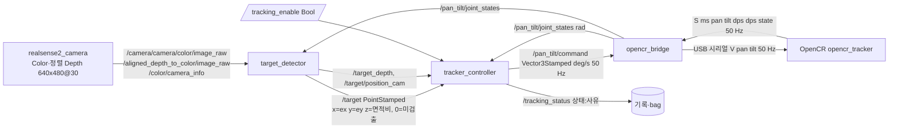

# 노드·연결 구조 (문제 2)

| 노드 | 책임 | 실패 시 동작 |
|---|---|---|
| target_detector | HSV·Contour·크기 검증·선택, /target 발행 (영상마다, 원본 stamp 유지) | 카메라가 멈추면 발행하지 않음, 미검출이면 z=0 |
| tracker_controller | IDLE/TRACKING/LOST, 각도 Kp P 제어, 속도 상한·데드밴드 | z=0 첫 프레임부터 0, 입력 0.5 s 끊기면 LOST:input_timeout |
| opencr_bridge | 명령 → 시리얼 V, 상태 줄 → joint_states | 명령 0.2 s 끊기면 V 0 0 |
| OpenCR | 속도 실행, 각도·속도 제한 | V 300 ms 끊기면 속도 0 (토크 유지) |

인터페이스 정의: docs/interface.md
