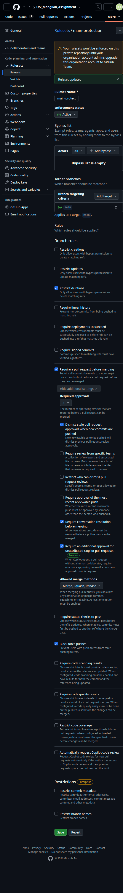

# 팀 협업 기록 — 몽글리안

- 팀 저장소: https://github.com/SpartaPA/Lv2_Monglian_Assignment
- 제출 명칭: Lv2_몽글리안_과제
- 제출 태그: `lv2-module5-submit` (TODO: 생성 후 링크)

> 링크는 모두 GitHub의 실제 Issue·PR·리뷰 주소를 사용합니다. 아직 없는 항목은 `TODO`로 두고 채운 뒤 삭제합니다.

---

## 1. 팀원 역할과 기여 요약

| 이름 / GitHub ID | 역할 | 담당 Issue | 병합된 본인 PR | 다른 PR 리뷰 | 구현·검증 내용 |
|---|---|---|---|---|---|
| 온창범 / [Onbeom](https://github.com/Onbeom) | 팀장 · 테크리드 + 검증 | [#1](https://github.com/SpartaPA/Lv2_Monglian_Assignment/issues/1) | [#2](https://github.com/SpartaPA/Lv2_Monglian_Assignment/pull/2) | TODO | 검증, 루트·모듈 README 작성, TODO |
| 권형중 / [JuneKunst](https://github.com/JuneKunst) | 통합 | TODO | TODO | TODO | 통합, TODO |
| 최성진 / [Choi-sungjin](https://github.com/Choi-sungjin) | 인지 | TODO | TODO | TODO | 인지, TODO |
| 천경호 / [pizzaafterhangover](https://github.com/pizzaafterhangover) | 제어 | TODO | TODO | TODO | 제어, TODO |

필수 조건: 4명 모두 **본인 PR 1건 이상 병합** + **다른 사람 PR에 의미 있는 리뷰 1건 이상**. 팀장 PR은 다른 팀원이 승인한 뒤 팀장이 병합합니다.

## 2. PR 기록

| PR | 제목 | 작성자 | 연결 Issue | 리뷰·승인자 | 리뷰 요지 | 병합자 · 일자 |
|---|---|---|---|---|---|---|
| [#2](https://github.com/SpartaPA/Lv2_Monglian_Assignment/pull/2) | docs: 루트·모듈 README 작성 | 온창범 | [#1](https://github.com/SpartaPA/Lv2_Monglian_Assignment/issues/1) | 천경호 · [리뷰 1](https://github.com/SpartaPA/Lv2_Monglian_Assignment/pull/2#pullrequestreview-5376121405) | ros humble -> ros lyrical로 변경 요청 → 반영: cc31d9e | 온창범 · 2026-10-01 |
| | | | | | | |

- 리뷰 링크는 PR의 **Files changed** 또는 **Conversation**에서 해당 리뷰의 `…` → **Copy link**로 복사합니다.
- 리뷰 요지에는 "확인했습니다"가 아니라 확인한 파일·조건·결과와 수정 요청·반영 내용을 적습니다.

## 3. 저장소 권한과 main 보호 설정

| 담당 | 권한 | 확인 |
|---|---|---|
| 온창범 (팀장) | Admin | 확인 |
| 권형중 | Write | 확인 |
| 최성진 | Write | 확인 |
| 천경호 | Write | 확인 |
| 운영팀(조직 관리 계정) | Admin | 확인 |

| main 보호 규칙 | 적용 여부 | 비고 |
|---|---|---|
| Require a pull request before merging | 적용 | |
| Require approvals (작성자 외 1명 이상) | 적용 | |
| Dismiss stale approvals on new commits | 적용 | |
| Require conversation resolution | 적용 | |
| Restrict who can push (main → 팀장) | 적용 | |
| Do not allow bypassing | 적용 | |
| force push · main 삭제 금지 | 적용 | |

- 설정 화면 캡처:  
- 보호 동작 확인 PR: [#2](https://github.com/SpartaPA/Lv2_Monglian_Assignment/pull/2)
- 적용할 수 없는 항목과 사유, 대신 사용한 운영 규칙: 없음

## 4. 대행·예외 기록

| 기간 | 사유 | 대행자 | 위임 권한 | 비고 |
|---|---|---|---|---|
| 없음 | | | | |

계정·비밀번호·토큰은 공유하지 않으며, 필요한 권한만 위임합니다.

## 5. 최종 통합 확인 (팀장)

| 항목 | 결과 | 근거 |
|---|---|---|
| 4명 모두 본인 PR 병합 1건 이상 | TODO | 1번 표 |
| 4명 모두 타인 PR 리뷰 1건 이상 | TODO | 1번 표 |
| 팀장 PR을 다른 팀원이 승인 | O | [리뷰 1](https://github.com/SpartaPA/Lv2_Monglian_Assignment/pull/2#pullrequestreview-5376121405) |
| 최종 main에서 다른 팀원과 실행·정지·재현 확인 | TODO | 확인자 · 날짜 · 커밋 |
| 제출 태그 생성 | TODO | 태그 링크 |
| 평가자가 저장소·영상·bag 링크에 접근 가능 | TODO | 확인자 · 날짜 |

- 확인자: 온창범 · 확인 일자: TODO · 기준 커밋: TODO
